# 2학년_8차시(시간)_임상현

## 개요

| 구분 | 내용 |
|---|---|
| 공간적 배경 | 마을 도서관 |
| 핵심 콘셉트 | 도서관 곳곳의 고장 난 시계와 안내판을 수학 힘(수리력)으로 해결 |

| 항목 | 내용 |
|---|---|
| 차시 번호 | 2-08 |
| 영역 | □ 수와 연산 □ 변화와 관계 ■ 도형과 측정 □ 자료와 가능성 |
| 성취 기준 | [2수03-08]1시간과 1분의 관계를 이해하고, 시간을 '시간', '분'으로 표현할 수 있다. |
| 성취기준별 성취수준 A | 1시간과 1분의 관계를 이용하여 실생활 상황에서 시간을 '몇 시간 몇 분'과 '몇 분'으로 각각 나타낼 수 있다. |
| 성취기준별 성취수준 B | 1시간과 1분의 관계를 이용하여 '몇 시간 몇 분'을 '몇 분'으로, '몇 분'을 '몇 시간 몇 분'으로 나타낼 수 있다. |
| 성취기준별 성취수준 C | 1시간이 60분임을 알고, 안내된 절차에 따라 '몇 시간'을 '몇 분'으로, '몇 분'을 '몇 시간'으로 나타낼 수 있다. |
| 내용 요소 | 시각과 시간 (몇 분 전 시각 읽기, 걸린 시간 구하기, 1일과 24시간의 관계) |
| 차시 주제 | 시간이 뒤죽박죽! 수학의 힘으로 도서관 시계를 수리하라! |

## 활동 1. 수리가 필요해요

### Scene 1. 타이틀 화면 (도입)

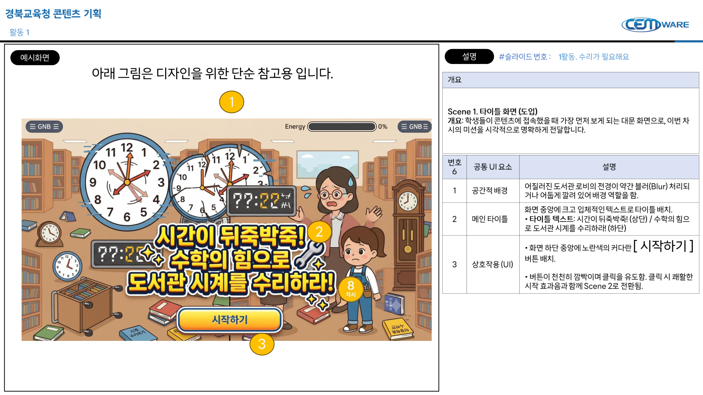

| 구분 | 내용 |
|---|---|
| 개요 | **Scene 1. 타이틀 화면 (도입)** **개요:** 학생들이 콘텐츠에 접속했을 때 가장 먼저 보게 되는 대문 화면으로, 이번 차시의 미션을 시각적으로 명확하게 전달합니다. |

| 번호 | 공통 UI 요소 | 설명 |
|---:|---|---|
| 1 | 공간적 배경 | 어질러진 도서관 로비의 전경이 약간 블러(Blur) 처리되어 게임의 배경 역할을 함. |
| 2 | 메인 타이틀 | 화면 중앙에 크고 입체적인 텍스트로 타이틀 배치. • 타이틀 텍스트: 시간이 뒤죽박죽! (상단) / 수학의 힘으로 도서관 시계를 수리하라! (하단) |
| 3 | 상호작용 (UI) | • 화면 하단 중앙에 노란색의 커다란 **[시작하기]** 버튼 배치. • 버튼이 천천히 깜빡이며 클릭을 유도함. 클릭 시 쾌활한 시작 효과음과 함께 Scene 2로 전환됨. |

### Scene 2. INTRO & PROBLEM (문제 발생)

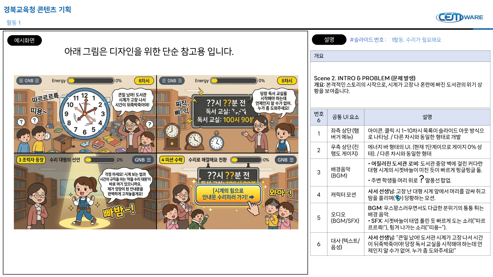

| 구분 | 내용 |
|---|---|
| 개요 | **Scene 2. INTRO & PROBLEM (문제 발생)** **개요:** 본격적인 스토리의 시작으로, 시계가 고장 나 혼란에 빠진 도서관의 위기 상황을 보여줍니다. |

| 번호 | 공통 UI 요소 | 설명 |
|---:|---|---|
| 1 | 좌측 상단(햄버거 메뉴) | 아이콘. 클릭 시 1~10차시 목록이 슬라이드 아웃 방식으로 나타남. / 다른 차시와 동일한 형태로 개발 |
| 2 | 우측 상단(진행도 게이지) | 에너지 바 형태의 UI. (현재 1단계이므로 게이지 0% 상태). / 다른 차시와 동일한 형태 |
| 3 | 배경음악 (BGM) | • **어질러진 도서관 로비:** 도서관 중앙 벽에 걸린 커다란 대형 시계의 시계바늘이 미친 듯이 빠르게 핑글핑글 돎. • 주변 학생들 머리 위로 ? 말풍선 팝업. |
| 4 | 캐릭터 모션 | 사서 선생님: 고장 난 대형 시계 앞에서 머리를 감싸 쥐고 땀을 흘리며(💦) 당황하는 모션. |
| 5 | 오디오 (BGM/SFX) | BGM: 우스꽝스러우면서도 다급한 분위기의 통통 튀는 배경 음악. • SFX: 시계바늘이 태엽 풀린 듯 빠르게 도는 소리("따르르르르!"), 튕겨 나가는 소리("띠용~"). |
| 6 | 대사 (텍스트/음성) | 사서 선생님: "큰일 났어! 도서관 시계가 고장 나서 시간이 뒤죽박죽이야! 당장 독서 교실을 시작해야 하는데 언제인지 알 수가 없어. 누가 좀 도와주세요!" |

### Scene 3. TUTORIAL (조력자 등장 및 튜토리얼)

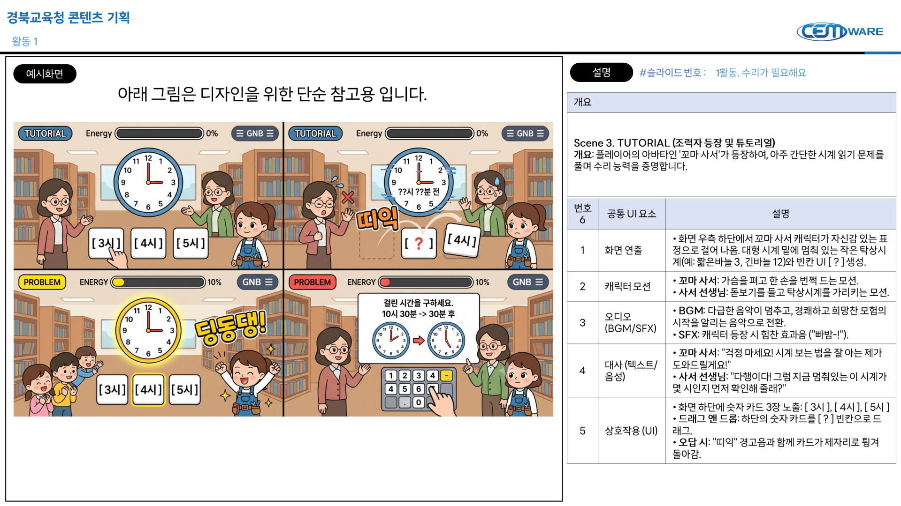

| 구분 | 내용 |
|---|---|
| 개요 | **Scene 3. TUTORIAL (조력자 등장 및 튜토리얼)** **개요:** 플레이어의 아바타인 '꼬마 사서'가 등장하여, 아주 간단한 시계 읽기 문제를 풀며 수리 능력을 증명합니다. |

| 번호 | 공통 UI 요소 | 설명 |
|---:|---|---|
| 1 | 화면 연출 | • 화면 우측 하단에서 꼬마 사서 캐릭터가 자신감 있는 표정으로 걸어 나옴. 대형 시계 밑에 멈춰 있는 작은 탁상시계(예: 짧은바늘 3, 긴바늘 12)와 빈칸 UI `[?]` 생성. |
| 2 | 캐릭터 모션 | • 꼬마 사서: 가슴을 펴고 한 손을 번쩍 드는 모션. • 사서 선생님: 돋보기를 들고 탁상시계를 가리키는 모션. |
| 3 | 오디오 (BGM/SFX) | • BGM: 다급한 음악이 멈추고, 경쾌하고 희망찬 모험의 시작을 알리는 음악으로 전환. • SFX: 캐릭터 등장 시 힘찬 효과음 ("빠밤-!"). |
| 4 | 대사 (텍스트/음성) | • 꼬마 사서: "걱정 마세요! 시계 보는 법을 잘 아는 제가 도와드릴게요!" • 사서 선생님: "다행이다! 그럼 지금 멈춰있는 이 시계가 몇 시인지 먼저 확인해 줄래?" |
| 5 | 상호작용 (UI) | • 화면 하단에 숫자 카드 3장 노출: `[3시]`, `[4시]`, `[5시]` • 드래그 앤 드롭: 하단의 숫자 카드를 `[?]` 빈칸으로 드래그. • 오답 시: "띠익" 경고음과 함께 카드가 제자리로 튕겨 돌아감. |

### Scene 4. SUCCESS (수리 성공 및 다음 단계 전환)

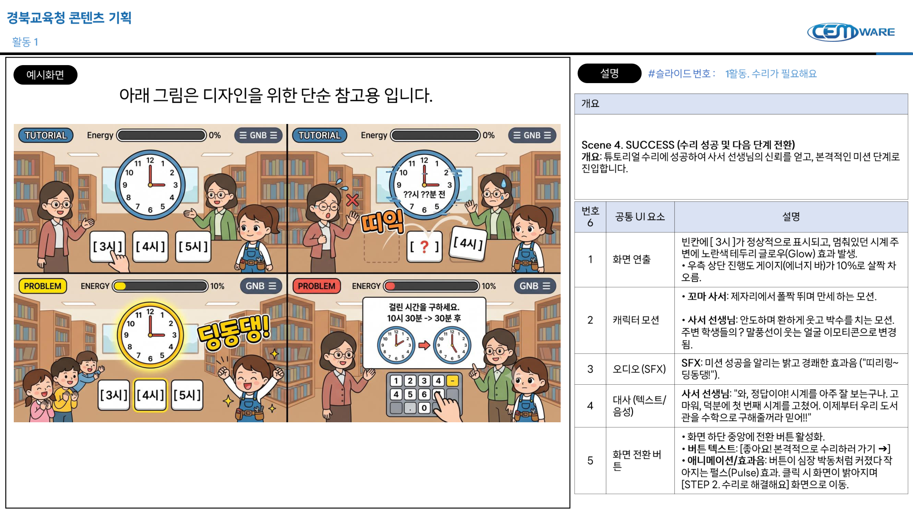

| 구분 | 내용 |
|---|---|
| 개요 | **Scene 4. SUCCESS (수리 성공 및 다음 단계 전환)** **개요:** 튜토리얼 수리에 성공하여 사서 선생님의 신뢰를 얻고, 본격적인 미션 단계로 진입합니다. |

| 번호 | 공통 UI 요소 | 설명 |
|---:|---|---|
| 1 | 화면 연출 | 빈칸에 `[3시]`가 정상적으로 표시되고, 멈춰있던 시계 주변에 노란색 테두리 글로우(Glow) 효과 발생. • 우측 상단 진행도 게이지(에너지 바)가 10%로 살짝 차오름. |
| 2 | 캐릭터 모션 | • 꼬마 사서: 제자리에서 폴짝 뛰며 만세 하는 모션. • 사서 선생님: 안도하며 환하게 웃고 박수를 치는 모션. 주변 학생들의 ? 말풍선이 웃는 얼굴 이모티콘으로 변경됨. |
| 3 | 오디오(SFX) | SFX: 미션 성공을 알리는 밝고 경쾌한 효과음 ("띠리링~딩동댕!"). |
| 4 | 대사 (텍스트/음성) | 사서 선생님: "와, 정답이야! 시계를 아주 잘 보는구나. 고마워, 덕분에 첫 번째 시계를 고쳤어. 이제부터 우리 도서관을 수학으로 구해줄거라 믿어!!" |
| 5 | 화면 전환 버튼 | • 화면 하단 중앙에 전환 버튼 활성화. • 버튼 텍스트: `[좋아요! 본격적으로 수리하러 가기 →]` • 애니메이션/효과음: 버튼이 심장 박동처럼 커졌다 작아지는 펄스(Pulse) 효과. 클릭 시 화면이 밝아지며 `[STEP 2. 수리로 해결해요]` 화면으로 이동. |

## 활동 2. 수리로 해결해요

### 문제 유형

| 번호 | 유형 | UI 요소 | 설명 |
|---:|---|---|---|
| 1 | 유형 A: 엉망이 된 도서관 시계 맞추기 ('몇 분 전' 시각 읽기) | 안내 데스크에 있는 아날로그 시계들이 고장 났습니다. 텍스트로 제시된 '몇 분 전' 시각을 보고, 알맞은 시계 바늘의 위치를 찾거나 그 반대로 읽어내는 퀘스트입니다. | - 문제 1: 전광판에 **[3시 5분 전]**이라고 적혀 있어요. 알맞은 시계를 찾아주세요! 보기: 2시 55분 시계(정답) / 3시 5분 시계 / 3시 55분 시계 - 문제 2: 멈춰버린 시계가 **[11시 50분]**을 가리키고 있어요. 다른 말로 어떻게 읽을까요? 보기: 11시 10분 전 / 12시 10분 전(정답) / 12시 50분 전 - 문제 3: 다음 중 **[8시 15분 전]**을 가리키는 시계는 어느 것인가요? 보기: 7시 45분 시계(정답) / 8시 15분 시계 / 8시 45분 시계 - 문제 4: 시계가 **[4시 55분]**에 멈췄어요. 바르게 읽은 것을 고르세요. 보기: 4시 5분 전 / 5시 5분 전(정답) / 5시 55분 전 |
| 2 | 유형 B: 독서 교실 시간표 복구하기 (걸린 시간과 시각 구하기) | 독서 교실의 시작 시각과 끝난 시각이 지워졌습니다. 시계와 타임라인(수직선)을 보고 걸린 시간이나 끝나는 시각을 구하여 시간표를 복구하는 퀘스트입니다. | - 문제 5: 첫 번째 독서 교실은 **8시**에 시작해서 **9시**에 끝났어요. 걸린 시간은 얼마인가요? 입력: `[1]`시간 - 문제 6: 두 번째 독서 교실은 **11시 30분**에 시작해서 **30분** 동안 진행돼요. 끝나는 시각은 언제일까요? 입력: `[12]`시 `[0]`분 - 문제 7: 책 정리 봉사활동을 오후 2시에 시작해서 **1시간** 동안 했어요. 봉사활동이 끝난 시각은 언제일까요? 보기: 오후 2시 30분 / 오후 3시(정답) / 오후 4시 - 문제 8: 꼬마 사서가 **4시 30분**부터 **5시**까지 책을 읽었어요. 책을 읽은 시간은 모두 몇 분일까요? 입력: `[30]`분 |
| 3 | 유형 C: 도서 대출 시스템 복구하기 (하루의 시간 관계 이해하기) | 도서관 시스템의 날짜와 시간 설정이 초기화되었습니다. 오전/오후의 개념과 1일이 24시간이라는 규칙을 입력하여 시스템을 재부팅하는 퀘스트입니다. | - 문제 9: 도서관 대출 시스템을 켜려면 암호가 필요해요. **24시간**은 며칠과 같을까요? 입력: `[1]`일 - 문제 10: 하루는 오전 `[?]`시간과 오후 `[?]`시간으로 이루어져 있어요. 빈칸에 알맞은 수를 넣으세요. 입력: `[12]`, `[12]` - 문제 11: 오늘 오후 **3시**에 책을 빌렸어요. 하루(1일)가 지나면 내일 언제일까요? 보기: 오전 3시 / 오후 3시(정답) / 오후 4시 - 문제 12: 이 마법 책은 딱 **1일** 동안만 빌릴 수 있어요. 1일은 모두 몇 시간인가요? 입력: `[24]`시간 |

### 공통 화면 설정 (Global UI)

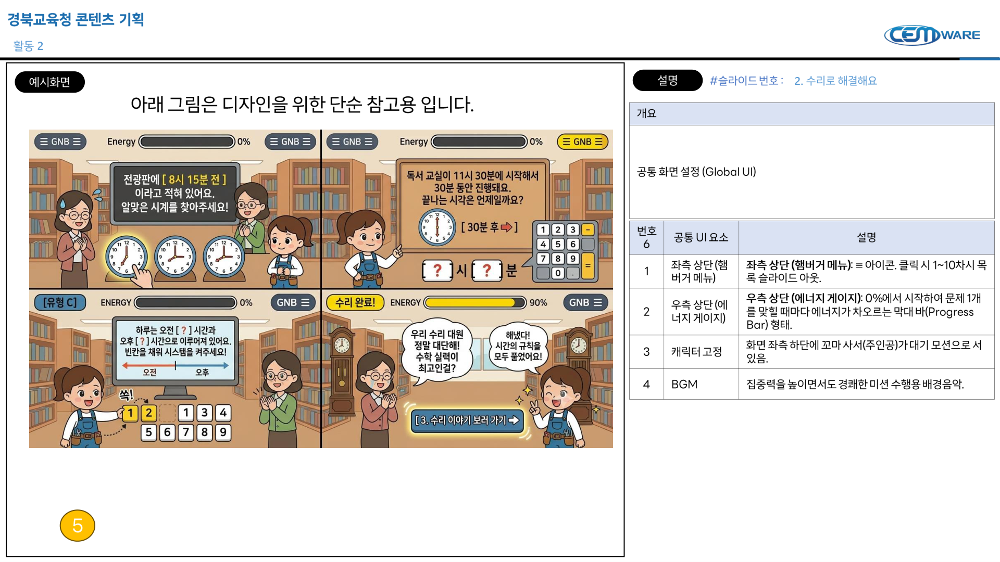

| 구분 | 내용 |
|---|---|
| 개요 | 공통 화면 설정 (Global UI) |

| 번호 | 공통 UI 요소 | 설명 |
|---:|---|---|
| 1 | 좌측 상단(햄버거 메뉴) | **좌측 상단 (햄버거 메뉴):** = 아이콘. 클릭 시 1~10차시 목록 슬라이드 아웃. |
| 2 | 우측 상단 (에너지 게이지) | **우측 상단 (에너지 게이지):** 0%에서 시작하여 문제 1개를 맞힐 때마다 에너지가 차오르는 막대 바(Progress Bar) 형태. |
| 3 | 캐릭터 고정 | 화면 좌측 하단에 꼬마 사서(주인공)가 대기 모션으로 서 있음. |
| 4 | BGM | 집중력을 높이면서도 경쾌한 미션 수행용 배경음악. |

### Scene 1. [유형 A] 엉망이 된 도서관 시계 맞추기 (객관식 터치)

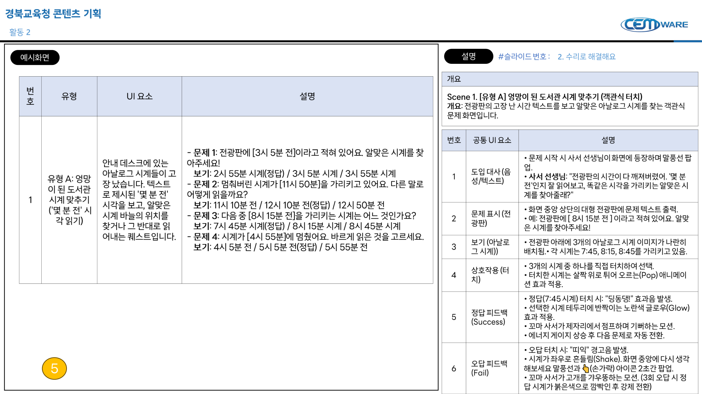

| 구분 | 내용 |
|---|---|
| 개요 | **Scene 1. [유형 A] 엉망이 된 도서관 시계 맞추기 (객관식 터치)** **개요:** 전광판의 고장 난 시간 텍스트를 보고 알맞은 아날로그 시계를 찾는 객관식 문제 화면입니다. |

| 번호 | 공통 UI 요소 | 설명 |
|---:|---|---|
| 1 | 도입 대사(음성/텍스트) | • 문제 시작 시 사서 선생님이 화면에 등장하며 말풍선 팝업. • 사서 선생님: "전광판의 시간이 다 깨져버렸어. '몇 분 전'인지 잘 읽어보고, 똑같은 시각을 가리키는 알맞은 시계를 찾아줄래?" |
| 2 | 문제 표시 (전광판) | • 화면 중앙 상단의 대형 전광판에 문제 텍스트 출력. • 예: 전광판에 `[8시 15분 전]`이라고 적혀 있어요. 알맞은 시계를 찾아주세요! |
| 3 | 보기 (아날로그 시계)) | • 전광판 아래에 3개의 아날로그 시계 이미지가 나란히 배치됨. • 각 시계는 7:45, 8:15, 8:45를 가리키고 있음. |
| 4 | 상호작용 (터치) | • 3개의 시계 중 하나를 직접 터치하여 선택. • 터치한 시계는 살짝 위로 튀어 오르는(Pop) 애니메이션 효과 적용. |
| 5 | 정답 피드백 (Success) | • 정답(7:45 시계) 터치 시: "딩동댕!" 효과음 발생. • 선택한 시계 테두리에 반짝이는 노란색 글로우(Glow) 효과 적용. • 꼬마 사서가 제자리에서 점프하며 기뻐하는 모션. • 에너지 게이지 상승 후 다음 문제로 자동 전환. |
| 6 | 오답 피드백 (Fail) | • 오답 터치 시: "띠익" 경고음 발생. • 시계가 좌우로 흔들림(Shake), 화면 중앙에 다시 생각해보세요 말풍선과 👆(손가락) 아이콘 2초간 팝업. • 꼬마 사서가 고개를 갸우뚱하는 모션. (3회 오답 시 정답 시계가 붉은색으로 깜박인 후 강제 전환) |

### Scene 2. [유형 B] 독서 교실 시간표 복구하기 (키패드 입력)

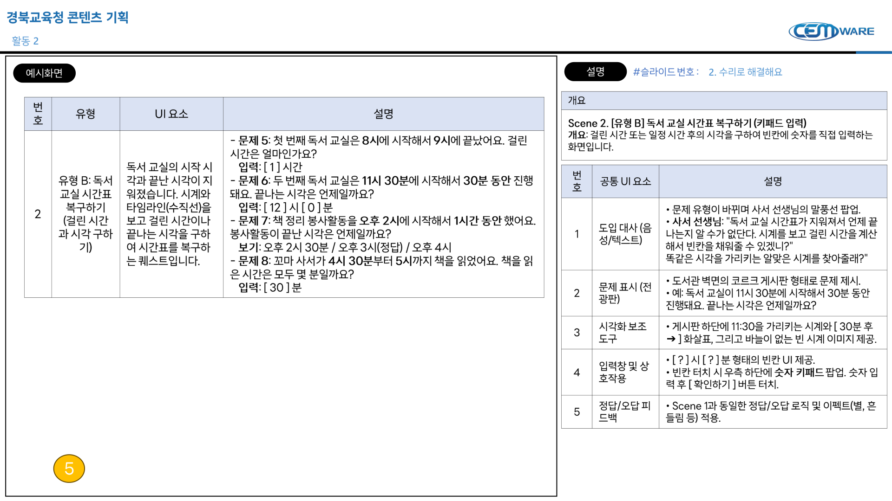

| 구분 | 내용 |
|---|---|
| 개요 | **Scene 2. [유형 B] 독서 교실 시간표 복구하기 (키패드 입력)** **개요:** 걸린 시간 또는 일정 시간 후의 시각을 구하여 빈칸에 숫자를 직접 입력하는 화면입니다. |

| 번호 | 공통 UI 요소 | 설명 |
|---:|---|---|
| 1 | 도입 대사 (음성/텍스트) | • 문제 유형이 바뀌며 사서 선생님의 말풍선 팝업. • 사서 선생님: "독서 교실 시간표가 지워져서 언제 끝나는지 알 수가 없다. 시계를 보고 걸린 시간을 계산해서 빈칸을 채워줄 수 있겠니?" |
| 2 | 문제 표시 (전광판) | • 도서관 벽면의 코르크 게시판 형태로 문제 제시. • 예: 독서 교실이 **11시 30분**에 시작해서 **30분** 동안 진행돼요. 끝나는 시각은 언제일까요? |
| 3 | 시각화 보조 도구 | • 게시판 하단에 **11:30**을 가리키는 시계와 `[30분 후 →]` 화살표, 그리고 바늘이 없는 빈 시계 이미지 제공. |
| 4 | 입력창 및 상호작용 | • `[?]`시 `[?]`분 형태의 빈칸 UI 제공. • 빈칸 터치 시 우측 하단에 숫자 키패드 팝업. 숫자 입력 후 `[확인하기]` 버튼 터치. |
| 5 | 정답/오답 피드백 | • Scene 1과 동일한 정답/오답 로직 및 이펙트(별, 흔들림 등) 적용. |

### Scene 3. [유형 C] 도서 대출 시스템 재부팅 (드래그 앤 드롭)

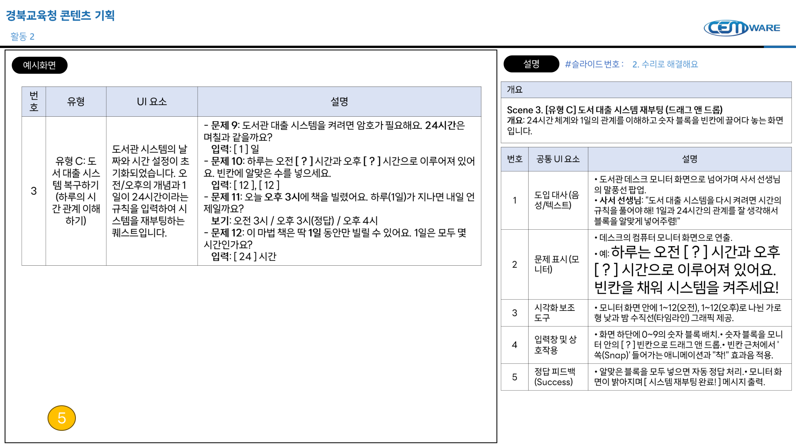

| 구분 | 내용 |
|---|---|
| 개요 | **Scene 3. [유형 C] 도서 대출 시스템 재부팅 (드래그 앤 드롭)** **개요:** 24시간 체계와 1일의 관계를 이해하고 숫자 블록을 빈칸에 끌어다 놓는 화면입니다. |

| 번호 | 공통 UI 요소 | 설명 |
|---:|---|---|
| 1 | 도입 대사 (음성/텍스트) | • 도서관 데스크 모니터 화면으로 넘어가며 사서 선생님의 말풍선 팝업. • 사서 선생님: "도서 대출 시스템을 다시 켜려면 시간의 규칙을 풀어야 해! 1일과 24시간의 관계를 잘 생각해서 블록을 알맞게 넣어주렴!" |
| 2 | 문제 표시 (모니터) | • 데스크의 컴퓨터 모니터 화면으로 연출. • 예: **하루는 오전 [?] 시간과 오후 [?] 시간으로 이루어져 있어요. 빈칸을 채워 시스템을 켜주세요!** |
| 3 | 시각화 보조 도구 | • 모니터 화면 안에 1~12(오전), 1~12(오후)로 나뉜 가로형 낮과 밤 수직선(타임라인) 그래픽 제공. |
| 4 | 입력창 및 상호작용 | • 화면 하단에 0~9의 숫자 블록 배치. • 숫자 블록을 모니터 안의 `[?]` 빈칸으로 드래그 앤 드롭. 빈칸 근처에서 쏙(Snap) 들어가는 애니메이션과 "착!" 효과음 적용. |
| 5 | 정답 피드백 (Success) | • 알맞은 블록을 모두 넣으면 자동 정답 처리. 모니터 화면이 밝아지며 `[시스템 재부팅 완료!]` 메시지 출력. |

### Scene 4. 수리 완료! (Outro)

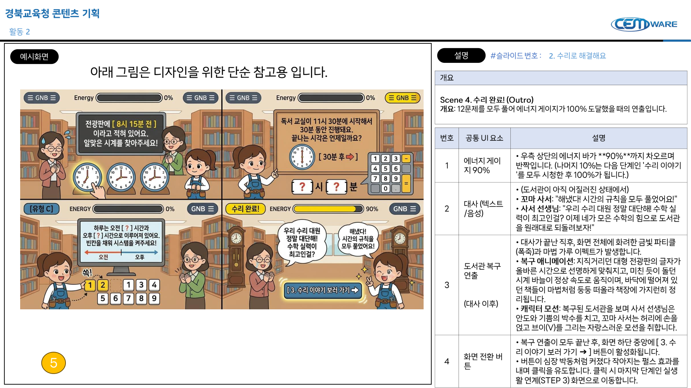

| 구분 | 내용 |
|---|---|
| 개요 | **Scene 4. 수리 완료! (Outro)** **개요:** 12문제를 모두 풀어 에너지 게이지가 100% 도달했을 때의 연출입니다. |

| 번호 | 공통 UI 요소 | 설명 |
|---:|---|---|
| 1 | 에너지 게이지 90% | • 우측 상단의 에너지 바가 **90%**까지 차오르며 반짝입니다. (나머지 10%는 다음 단계인 '수리 이야기'를 모두 시청한 후 100%가 됩니다.) |
| 2 | 대사 (텍스트/음성) | • (도서관이 아직 어질러진 상태에서) • 꼬마 사서: "해냈다! 시간의 규칙을 모두 풀었어요!" • 사서 선생님: "우리 수리 대원 정말 대단해! 수학 실력이 최고인걸? 이제 네가 모은 수학의 힘으로 도서관을 원래대로 되돌려보자!" |
| 3 | 도서관 복구 연출  (대사 이후) | • 대사가 끝난 직후, 화면 전체에 화려한 금빛 파티클(폭죽)과 마법 가루 이펙트가 발생합니다. • 복구 애니메이션: 지저거리던 대형 전광판의 글자가 올바른 시간으로 선명하게 맞춰지고, 미친 듯이 돌던 시계 바늘이 정상 속도로 움직이며, 바닥에 떨어져 있던 책들이 마법처럼 둥둥 떠올라 책장에 가지런히 정리됩니다. • 캐릭터 모션: 복구된 도서관을 보며 사서 선생님은 안도와 기쁨의 박수를 치고, 꼬마 사서는 허리에 손을 얹고 브이(V)를 그리는 자랑스러운 모션을 취합니다. |
| 4 | 화면 전환 버튼 | • 복구 연출이 모두 끝난 후, 화면 하단 중앙에 `[3. 수리 이야기 보러 가기 →]` 버튼이 활성화됩니다. • 버튼이 심장 박동처럼 커졌다 작아지는 펄스 효과를 내며 클릭을 유도합니다. 클릭 시 마지막 단계인 실생활 연계(STEP 3) 화면으로 이동합니다. |

## 활동 3. 수리 이야기

### Scene 1. 실생활 및 역사 연계

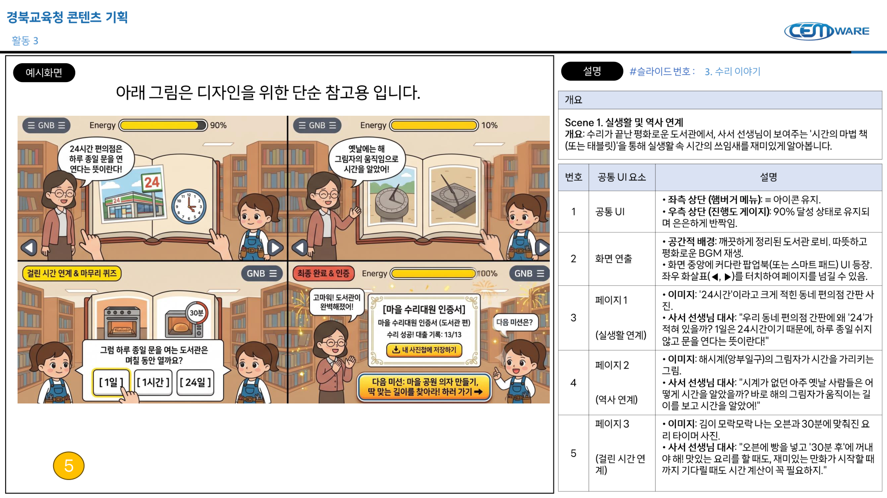

| 구분 | 내용 |
|---|---|
| 개요 | **Scene 1. 실생활 및 역사 연계** **개요:** 수리가 끝난 평화로운 도서관에서, 사서 선생님이 보여주는 '시간의 마법 책(또는 태블릿)'을 통해 실생활 속 시간의 쓰임새를 재미있게 알아봅니다. |

| 번호 | 공통 UI 요소 | 설명 |
|---:|---|---|
| 1 | 공통 UI | • **좌측 상단 (햄버거 메뉴):** = 아이콘 유지. • **우측 상단 (진행도 게이지):** 90% 달성 상태로 유지되며 은은하게 반짝임. |
| 2 | 화면 연출 | • **공간적 배경:** 깨끗하게 정리된 도서관 로비. 따뜻하고 평화로운 BGM 재생. • 화면 중앙에 커다란 팝업북(또는 스마트 패드) UI 등장. 좌우 화살표(◀, ▶)를 터치하여 페이지를 넘길 수 있음. |
| 3 | 페이지 1  (실생활 연계) | • **이미지:** '24시간'이라고 크게 적힌 동네 편의점 간판 사진. • 사서 선생님 대사: "우리 동네 편의점 간판에 왜 '24'가 적혀 있을까? 1일은 24시간이기 때문에, 하루 종일 쉬지 않고 문을 연다는 뜻이란다!" |
| 4 | 페이지 2  (역사 연계) | • **이미지:** 해시계(앙부일구)의 그림자가 시간을 가리키는 그림. • 사서 선생님 대사: "시계가 없던 아주 옛날 사람들은 어떻게 시간을 알았을까? 바로 해의 그림자가 움직이는 길이를 보고 시간을 알았어!" |
| 5 | 페이지 3  (걸린 시간 연계) | • **이미지:** 김이 모락모락 나는 오븐과 30분에 맞춰진 요리 타이머 사진. • 사서 선생님 대사: "오븐에 빵을 넣고 '30분 후'에 꺼내야 해! 맛있는 요리를 할 때도, 재미있는 만화가 시작할 때까지 기다릴 때도 시간 계산이 꼭 필요하지." |

### Scene 2. 가벼운 마무리 퀴즈 (Pop-up Quiz)

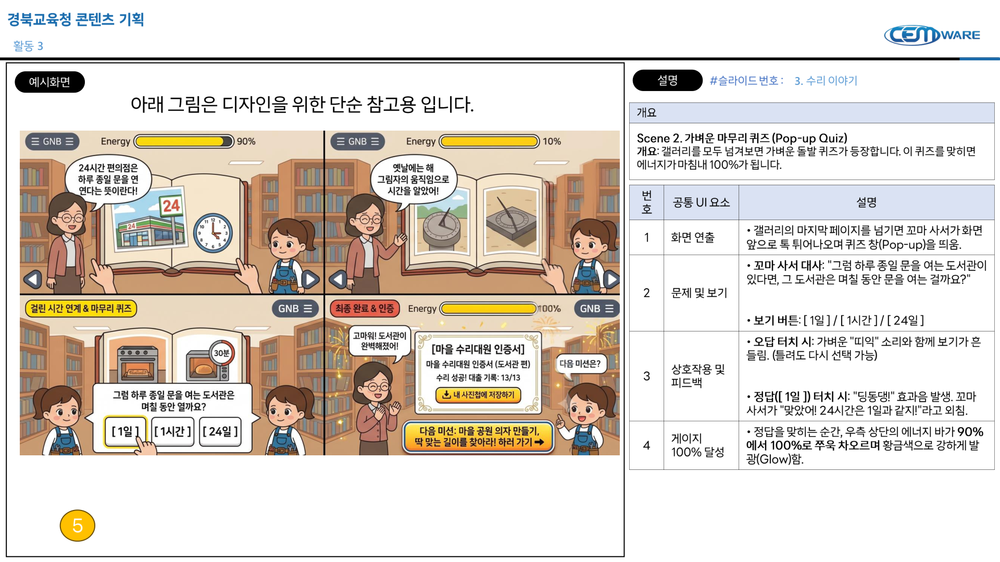

| 구분 | 내용 |
|---|---|
| 개요 | **Scene 2. 가벼운 마무리 퀴즈 (Pop-up Quiz)** **개요:** 갤러리를 모두 넘겨보면 가벼운 돌발 퀴즈가 등장합니다. 이 퀴즈를 맞히면 에너지가 마침내 100%가 됩니다. |

| 번호 | 공통 UI 요소 | 설명 |
|---:|---|---|
| 1 | 화면 연출 | • 갤러리의 마지막 페이지를 넘기면 꼬마 사서가 화면 앞으로 톡 튀어나오며 퀴즈 창(Pop-up)을 띄움. |
| 2 | 문제 및 보기 | • 꼬마 사서 대사: "그럼 하루 종일 문을 여는 도서관이 있다면, 그 도서관은 며칠 동안 문을 여는 걸까요?"  • 보기 버튼: `[1일]` / `[1시간]` / `[24일]` |
| 3 | 상호작용 및 피드백 | • 오답 터치 시: 가벼운 "띠익" 소리와 함께 보기가 흔들림. (틀려도 다시 선택 가능)  • 정답(`[1일]`) 터치 시: "딩동댕!" 효과음 발생. 꼬마 사서가 "맞았어! 24시간은 1일과 같지!"라고 외침. |
| 4 | 게이지 100% 달성 | • 정답을 맞히는 순간, 우측 상단의 에너지 바가 **90%에서 100%로 쭈욱** 차오르며 황금색으로 강하게 발광(Glow)함. |

### Scene 3. 최종 완료 및 인증 (Outro & Hook)

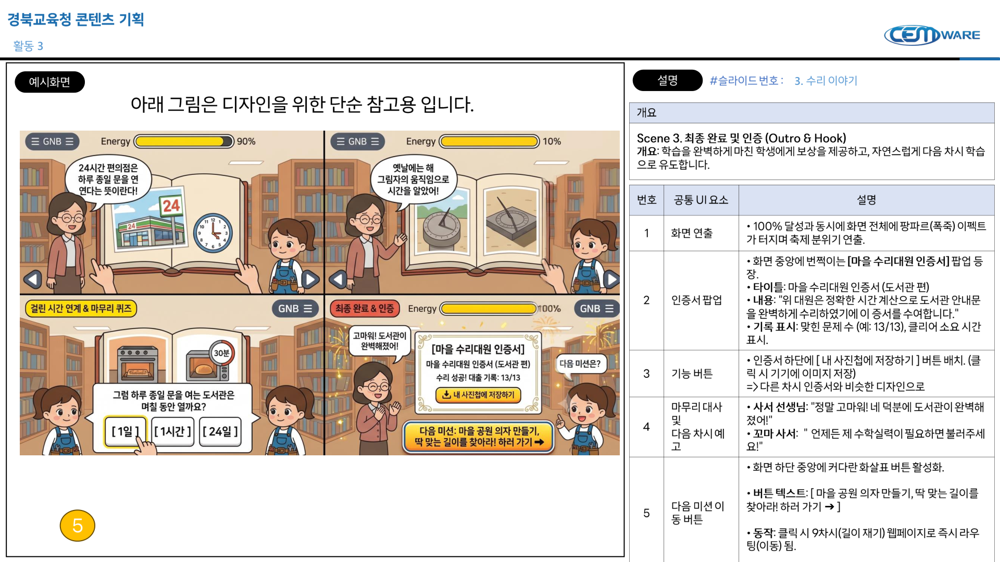

| 구분 | 내용 |
|---|---|
| 개요 | **Scene 3. 최종 완료 및 인증 (Outro & Hook)** **개요:** 학습을 완벽하게 마친 학생에게 보상을 제공하고, 자연스럽게 다음 차시 학습으로 유도합니다. |

| 번호 | 공통 UI 요소 | 설명 |
|---:|---|---|
| 1 | 화면 연출 | • 100% 달성과 동시에 화면 전체에 팡파르(폭죽) 이펙트가 터지며 축제 분위기 연출. |
| 2 | 인증서 팝업 | • 화면 중앙에 반짝이는 **[마을 수리대원 인증서]** 팝업 등장. • 타이틀: 마을 수리대원 인증서 (도서관 편) • 내용: "위 대원은 정확한 시간 계산으로 도서관 안내문을 완벽하게 수리하였기에 이 증서를 수여합니다." • 기록 표시: 맞힌 문제 수 (예: 13/13), 클리어 소요 시간 표시. |
| 3 | 기능 버튼 | • 인증서 하단에 `[내 사진첩에 저장하기]` 버튼 배치. (클릭 시 기기에 이미지 저장) => 다른 차시 인증서와 비슷한 디자인으로 |
| 4 | 마무리 대사 및 다음 차시 예고 | • 사서 선생님: "정말 고마워! 네 덕분에 도서관이 완벽해졌어!" • 꼬마 사서: "언제든 제 수학실력이 필요하면 불러주세요!" |
| 5 | 다음 미션 이동 버튼 | • 화면 하단 중앙에 커다란 화살표 버튼 활성화.  • 버튼 텍스트: `[마을 공원 의자 만들기, 딱 맞는 길이를 찾아라! 하러 가기 →]`  • 동작: 클릭 시 9차시(길이 재기) 웹페이지로 즉시 라우팅(이동) 됨. |
