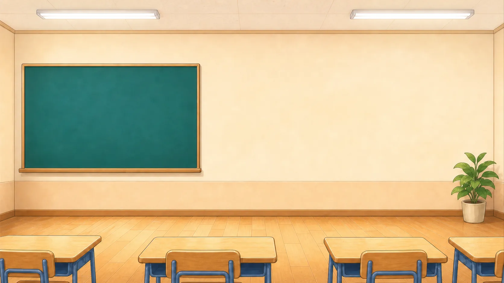
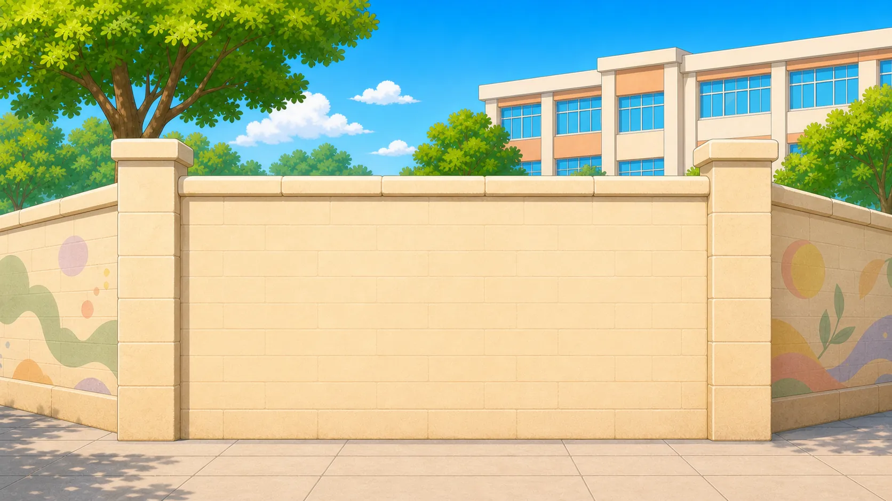
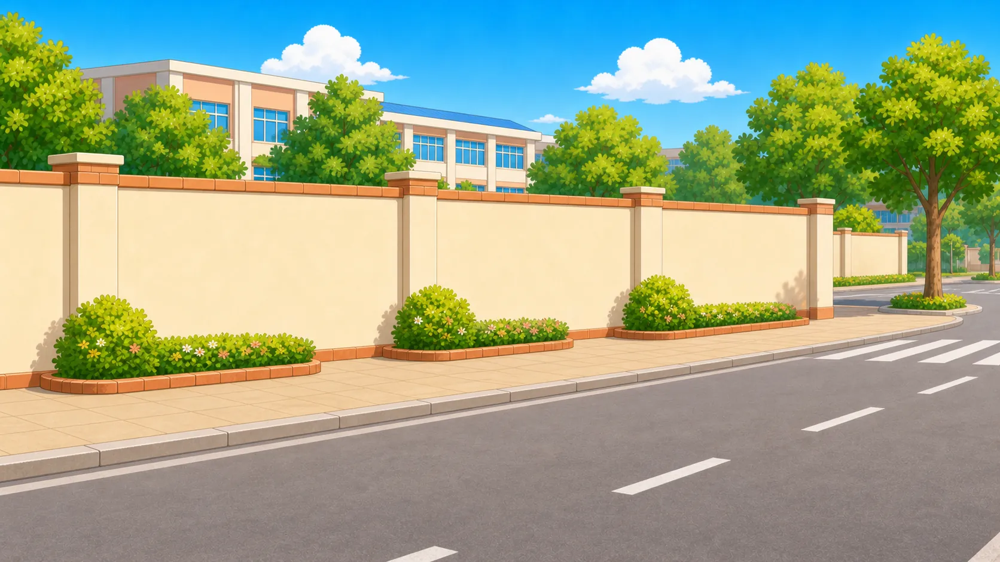
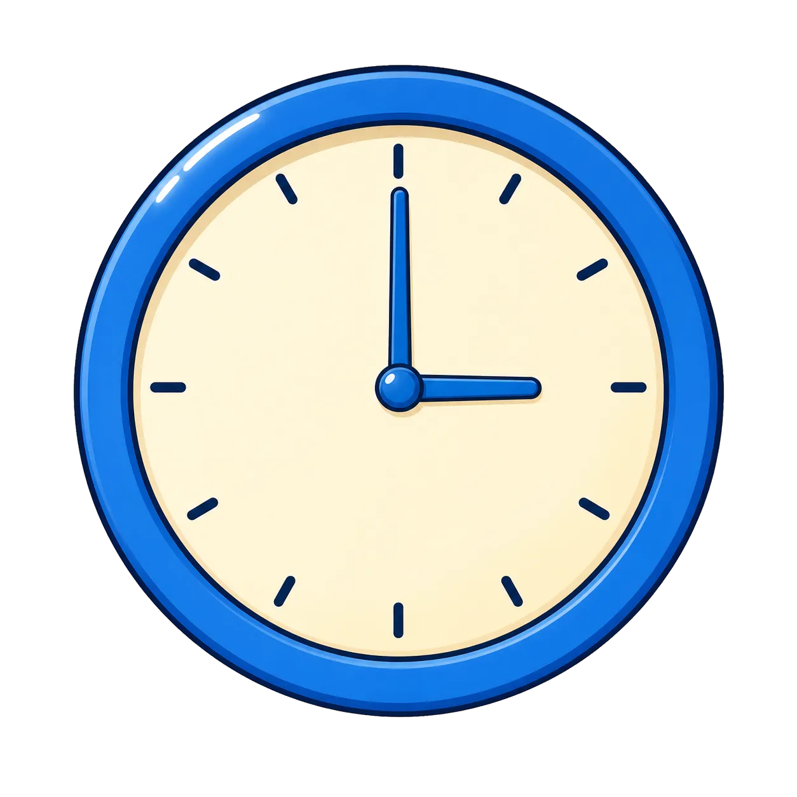
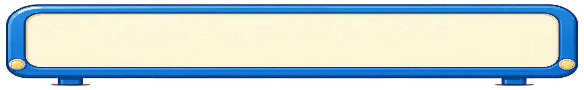

# Assets — 백승용

배경, 소품, UI 표면, CTA의 화풍 기준이다.

**여기 있는 이미지의 소재를 새 차시로 끌어오지 않는다.** 학교 담장이 도서관 차시에 나오면 실패다.
가져오는 것은 그 소재를 어떻게 그렸는가 — 선, 채도, 명암 단계, 밀도, 재질 표현이다.

`## 항목`에 `- Path:`가 달린 절이 catalog 항목이고, `stages/scripts/teacher_source.py`가 스캔한다.
`Use`와 `Avoid`가 그대로 모델에 전달되므로 **input.json에 다시 적지 않는다.**

---

## indoor-classroom

- Path: `assets/backgrounds/indoor-classroom.webp`
- Category: `backgrounds`
- Status: `approved`
- Role: 실내 공간 배경의 기준
- Use:
  - 따뜻한 크림 벽과 나무 바닥의 조합
  - 천장 광원으로 위에서 내리는 조명, 낮은 대비의 부드러운 그림자 한 겹
  - 외곽선 없이 면의 색 경계로만 형태를 만드는 배경 처리
  - 가구를 화면 하단에 잘리게 두어 공간을 넓히는 구도
- Avoid:
  - 칠판과 책상 배열이라는 교실 소재를 그대로 가져오는 것

Source: `production/1-2/08/assets/classroom-shape-search.webp`

## outdoor-wall-frontal

- Path: `assets/backgrounds/outdoor-wall-frontal.webp`
- Category: `backgrounds`
- Status: `approved`
- Role: 활동 무대가 되는 근경 구도의 기준
- Use:
  - 활동 면을 화면 중앙에 크게 비우고 좌우로 원근을 접는 구도
  - 벽면 재질을 노이즈 없이 경계선만으로 내는 방식
  - 중앙을 비워 캐릭터와 UI가 얹힐 자리를 남기는 배치
- Avoid:
  - 학교 담장과 벽화 모티프

Source: `production/1-2/08/assets/school-wall-problem-scene.webp`

## outdoor-street-wide

- Path: `assets/backgrounds/outdoor-street-wide.webp`
- Category: `backgrounds`
- Status: `approved`
- Role: 원경과 하늘의 팔레트 기준
- Use:
  - 하늘의 채도와 구름 형태
  - 나뭇잎을 뭉치로 묶는 방식
  - 원근에 따른 디테일 감소, 노면과 보도의 명암 단계
- Avoid:
  - 학교 담장, 화단, 횡단보도라는 소재 자체

Source: `production/1-2/08/assets/school-road-background.webp`

### 배경 공통 계약

배경은 `1672x941`(16:9) 불투명 raster다. **외곽선이 없다.** 면과 면의 색 경계로만 형태를 만든다.
캐릭터와 UI가 위에 얹히므로 중앙은 비우고 정보는 가장자리에 둔다.

---

## prop-wall-clock

- Path: `assets/props/prop-wall-clock.webp`
- Category: `props`
- Status: `approved`
- Role: 원형 계기 소품의 작화 기준
- Use:
  - 캐릭터보다 굵은 짙은 남색 외곽선
  - 테두리 두께와 안쪽 면의 대비, 눈금을 단순한 선으로 처리하는 밀도
  - 플랫한 면에 광택 하이라이트 한 줄
  - 정사각 투명 배경
- Avoid:
  - 이 시계의 파란 테두리 색을 그대로 쓰는 것
  - 바늘이 상태에 따라 변하는 콘텐츠에서 바늘까지 그리는 것. 그때는 몸체만 그린다

## prop-road-sign

- Path: `assets/props/prop-road-sign.webp`
- Category: `props`
- Status: `approved`
- Role: 표지·표식류 소품의 작화 기준
- Use:
  - 면 분할과 테두리 처리
  - 판이 지면에 서 있는 물건으로 보이게 하는 두께 표현
- Avoid:
  - 교통 표지 모티프

## prop-paint-can

- Path: `assets/props/prop-paint-can.webp`
- Category: `props`
- Status: `approved`
- Role: 원통형 물체의 재질 기준
- Use:
  - 광택 하이라이트의 위치와 개수로 재질을 내는 방식
- Avoid:
  - 페인트·색칠 소재

## prop-hammer

- Path: `assets/props/prop-hammer.webp`
- Category: `props`
- Status: `approved`
- Role: 손잡이가 있는 도구의 작화 기준
- Use:
  - 도구를 비스듬히 뉘어 길이를 보여주는 각도
  - 그립부의 단순화 정도
- Avoid:
  - 수리·공구 소재

### 소품 공통 계약

소품은 `1254x1254` 정사각 투명 raster다.
외곽선이 **캐릭터보다 굵고 짙은 남색 계열**이다. 플랫한 면에 광택 하이라이트 한 줄로 재질을 낸다.

**가변부는 그리지 않는다.** 시계 예시에 바늘이 있는 것은 그 차시에서 시계가 고정 소품이었기 때문이다.
바늘·표시값·켜진 불빛이 상태에 따라 변하는 콘텐츠에서는 몸체만 그리고 가변부는 HTML/CSS가 얹는다.

---

## surface-info-board

- Path: `assets/ui/surface-info-board.webp`
- Category: `props`
- Status: `approved`
- Role: 가로로 긴 안내판 표면의 기준
- Use:
  - 짙은 남색 굵은 테두리와 안쪽 크림색 빈 면
  - 판의 두께와 그림자로 장면 속 물건임을 드러내는 방식
  - 나사머리와 다리 같은 물리적 디테일
- Avoid:
  - SVG 패널이나 flat icon처럼 보이는 것
  - 안쪽 면에 장식을 넣어 글자 자리를 침범하는 것

## surface-choice-plaque

- Path: `assets/ui/surface-choice-plaque.webp`
- Category: `props`
- Status: `approved`
- Role: 보기 카드 표면의 기준
- Use:
  - 얇은 판의 두께 표현
  - 안쪽 면을 완전히 비우는 처리
- Avoid:
  - 이 판의 크기 비율을 그대로 쓰는 것

## surface-title-banner

- Path: `assets/ui/surface-title-banner.webp`
- Category: `props`
- Status: `approved`
- Role: 씬 제목판 몸체의 기준
- Use:
  - 제목판 몸체의 장식 밀도
- Avoid:
  - 문구를 굽는 제목 asset의 기준으로 쓰는 것. 그건 `source/common/craft-examples/title-lettering`이다

### UI 표면 공통 계약

**글자가 얹힐 빈 표면**이다. 문구를 굽지 않는다.
`style_reference_set`에 `ui` 범주가 없으므로 `Category`는 `props`로 둔다. 디렉토리만 `ui/`다.

- 안쪽 면은 **크림색으로 완전히 비운다.** 장식을 넣으면 글자가 겹친다
- 테두리는 짙은 남색 굵은 선 + 안쪽 밝은 파랑 면
- 판 자체에 두께와 그림자가 있어 화면에 붙은 스티커가 아니라 놓인 물건으로 보인다
- **SVG 패널·flat icon·CSS 컴포넌트처럼 보이면 실패다**

---

## cta-activity-body

- Path: `assets/cta/cta-activity-body.webp`
- Category: `ctas`
- Status: `approved`
- Role: 진행 CTA 버튼 몸체의 기준
- Use:
  - 알약형 버튼의 두께
  - 테두리 색과 면 색의 대비
  - 눌림 상태의 그림자 변화
- Avoid:
  - 라벨 문구
  - 크림·갈색 팔레트. 이건 학교 담장 차시의 색이다. 새 차시는 그 세계관의 색으로 그린다
  - 이 파일을 output에 복사하는 것. **보고 새로 그린다**

한때 이 파일이 `source/common/components/ticket-button/assets/`에도 있어서,
"복사해서 쓰는 것"과 "참조만 하는 것" 두 역할을 동시에 가졌다.
`runs/2026-08-11_65126dad`에서 builder가 계약대로 컴포넌트 asset을 복사했는데
결과 파일이 화풍 참조와 같아 design_review가 "must_follow 참조를 복제했다"는 오판을 냈다.

컴포넌트에서 이미지를 들어내 해소했다. 컴포넌트는 이제 구조·동작만 갖고
버튼 몸체는 `--cta-body`로 밖에서 받는다.

## cta-completion-body

- Path: `assets/cta/cta-completion-body.webp`
- Category: `ctas`
- Status: `approved`
- Role: 완료 화면 CTA의 기준
- Use:
  - 완료 장면 CTA의 장식 밀도와 위계
- Avoid:
  - 라벨 문구와 이 차시의 소재

### CTA 공통 계약

**라벨을 구운 CTA는 스프라이트 방식을 쓰지 않는다.** 프레임마다 글자를 다시 그리면 누를 때 글자가 어긋난다.
굽는 CTA는 단일 이미지 하나로 만들고 상태는 CSS가 표현한다.
굽기 판정은 `prompts/planner_system.md`의 "이미지 안의 텍스트(가변 vs 고정)" 절이 정한다.

---

## 전 범주 공통

- 한 콘텐츠 안에서 배경·소품·UI의 화풍을 섞지 않는다
- 캐릭터 위에 얹히는 것은 배경을 투명하게 만든다
- 문항·보기·정답·상태 표시처럼 **바뀌는 글자는 어떤 경우에도 굽지 않는다**
