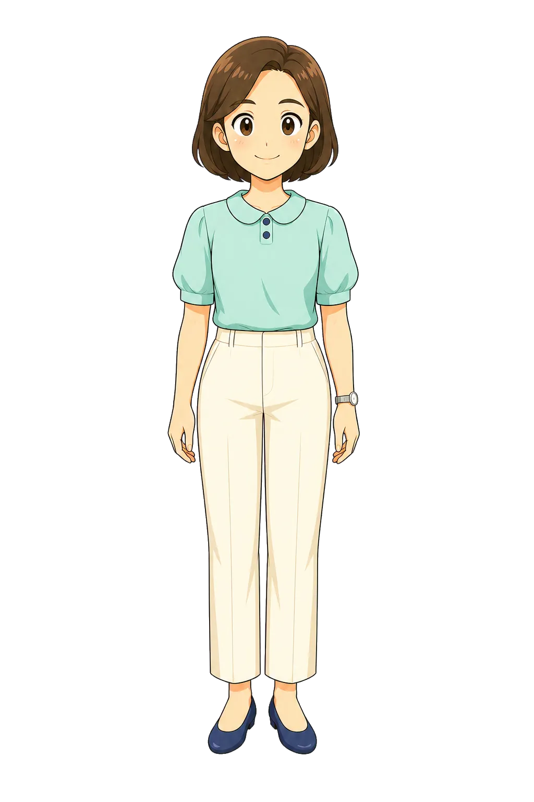
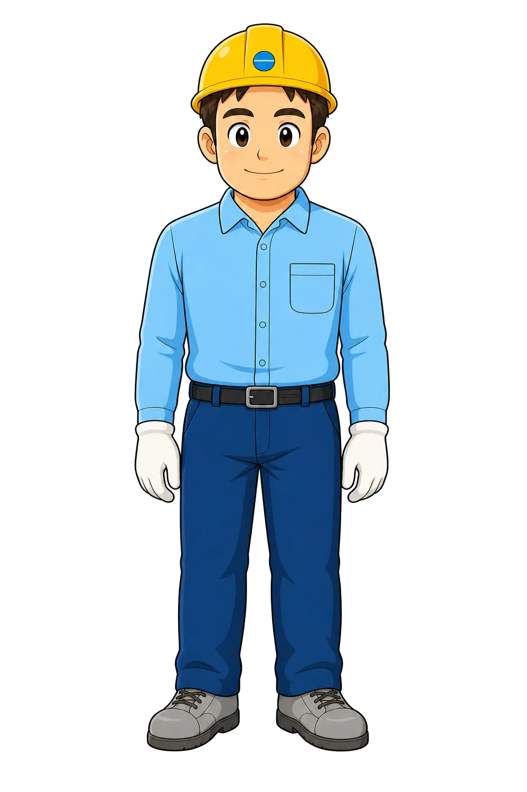
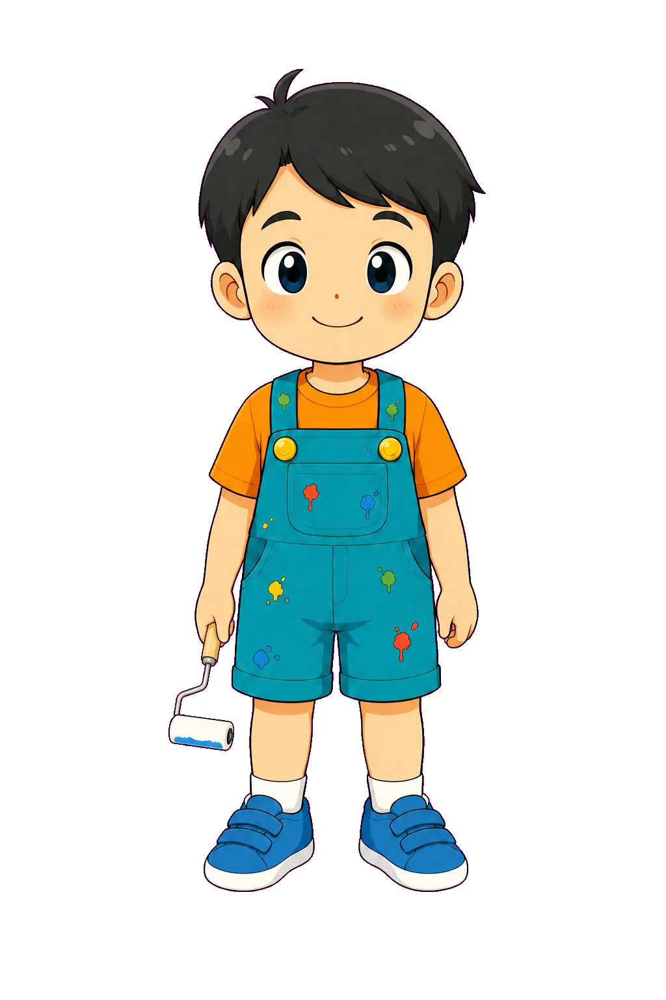

# Characters — 백승용

여기 있는 캐릭터는 **다른 차시에 그대로 재등장시키라고 두는 것이 아니다.**
새 차시는 그 스토리보드가 정한 인물을 쓴다.

이 목록의 쓸모는 **연령대별 작화 기준**이다.
새 인물이 성인 여성이면 `teacher` 계열을, 성인 남성이면 `worker` 계열을, 어린이면 `student` 계열을
선·비율·명암·표정 언어의 기준으로 삼는다. **얼굴·헤어·의상·이름은 복제하지 않는다.**

같은 차시 안에서 같은 인물을 여러 pose로 그릴 때만 identity를 그대로 유지한다.

`## 항목`에 `- Path:`가 달린 절만 catalog 항목이다. pose 표는 사람이 읽는 참고 자료이고 스캔되지 않는다 —
화풍 참조로는 계열당 한둘이면 충분하고, 같은 인물의 모든 pose를 참조로 밀어 넣으면
`asset_generator`가 한 호출에 2~3개만 쓰는 규칙과 어긋난다.

---

## teacher-identity

- Path: `assets/characters/teacher-idle.webp`
- Category: `characters`
- Status: `approved`
- Role: 성인 여성 캐릭터의 작화 기준
- Use:
  - 7~7.5등신 비율
  - 짙은 갈색 중간 두께 외곽선
  - 큰 타원 눈에 흰 하이라이트 1~2점, 옅은 분홍 홍조, 단순한 선 하나의 입
  - 전신 정면, 투명 배경
- Avoid:
  - 갈색 단발·민트 블라우스·크림 팬츠라는 이 인물의 얼굴과 의상을 새 인물에게 복제하는 것
  - 어린이를 이 등신으로 그리는 것

Identity (이 인물에만 해당, 복제 금지): 갈색 단발, 민트 반팔 블라우스(둥근 카라 + 네이비 단추 2개),
크림 와이드 팬츠, 네이비 플랫슈즈, 왼손목 은색 시계.

### Poses

| Pose | Path | Description | Use |
|---|---|---|---|
| idle | `assets/characters/teacher-idle.webp` | 양손을 내린 기본 대기 | 상시 배치, 일반 안내 |
| explaining | `assets/characters/teacher-explaining.webp` | 한 손으로 가리키며 설명 | 개념 설명, 문제 제시 |
| praising | `assets/characters/teacher-praising.webp` | 칭찬·축하 | 정답 feedback |

## teacher-expression

- Path: `assets/characters/teacher-praising.webp`
- Category: `characters`
- Status: `approved`
- Role: 성인 캐릭터의 표정·동작 언어 기준
- Use:
  - 감정을 눈썹 각도와 입꼬리로만 내고 과장하지 않는 표현 범위
  - 팔 동작의 각도와 손 모양의 단순화 정도
- Avoid:
  - 이 인물의 의상과 헤어
  - 표정을 만화적으로 과장하는 것

## worker-identity

- Path: `assets/characters/worker-idle.webp`
- Category: `characters`
- Status: `approved`
- Role: 성인 남성 캐릭터의 작화 기준
- Use:
  - 7~7.5등신 비율
  - 성인 남성의 어깨 폭과 체형 단순화 정도
  - 전신 정면, 투명 배경
- Avoid:
  - 노란 안전모·하늘색 셔츠·흰 목장갑이라는 직군 의상을 다른 직군의 인물에게 입히는 것

Identity (복제 금지): 노란 안전모, 하늘색 셔츠, 네이비 작업바지 + 검정 벨트, 흰 목장갑, 회색 안전화.

### Poses

| Pose | Path | Description | Use |
|---|---|---|---|
| idle | `assets/characters/worker-idle.webp` | 기본 대기 | 상시 배치 |
| explaining | `assets/characters/worker-explaining.webp` | 손바닥을 펴 안내 | 절차 안내, 대상 지시 |
| apologizing | `assets/characters/worker-apologizing.webp` | 곤란·사과 | 문제 상황 제시 |

## student-identity

- Path: `assets/characters/student-idle.webp`
- Category: `characters`
- Status: `approved`
- Role: 어린이 캐릭터의 작화 기준
- Use:
  - 4~4.5등신 대두 비율
  - 성인보다 크고 둥근 눈
  - 전신 정면, 투명 배경
- Avoid:
  - 주황 티셔츠·청록 멜빵바지라는 이 인물의 의상을 새 인물에게 복제하는 것
  - 성인 등신으로 그리는 것

Identity (복제 금지): 검은 짧은 머리에 앞머리 한 가닥, 주황 티셔츠, 청록 멜빵 반바지(물감 얼룩),
흰 양말, 파란 벨크로 운동화. 손에 든 소품은 그 차시의 활동에 맞춰 바꾼다 — 정체성이 아니다.

### Poses

| Pose | Path | Description | Use |
|---|---|---|---|
| idle | `assets/characters/student-idle.webp` | 기본 대기 | 상시 배치 |
| thinking | `assets/characters/student-thinking.webp` | 고민 | 문제 풀이 중, 오답 feedback |
| volunteer | `assets/characters/student-volunteer.webp` | 손 들고 나섬 | 도전 시작, 정답 feedback |

---

## 공통 계약

- 전신, 투명 배경, 세로 2:3 비율(`1024x1536`)
- 정면 또는 준정면. 화면 안쪽을 향한다
- 발밑에 배경이 딸려 오지 않는다. 그림자도 굽지 않는다
- **성인과 어린이가 한 화면에 있으면 키 차이가 분명히 보여야 한다**
- 한 차시 안에서 pose를 추가할 때는 `identity_context`로 기존 pose를 함께 넘겨 인물 일치를 맞춘다
