# 수리력 1차_1학년 2학기 8차시 (백승용) 723 요청

## History

| Version. | Date. | Content. | Page. | Owner. |
|---|---|---|---:|---|
| v1.0 | 26/07/23 | • 신규 제작 | 10 | 백승용 |

## 개요

| 구분 | 내용 |
|---|---|
| 공간적 배경 | • 학교 담장(학교 담장 → 담장 벽(클로즈업)→ 학교 담장) |
| 핵심 콘셉트 | • 학교의 담장이 무너지고 다시 보수한 상황에서 벽화를 그림 • 사각형, 삼각형, 원 모양의 도형을 찾고, 그 모양을 이용하여 세 수의 덧셈과 뺄셈을 함 |

| 항목 | 내용 |
|---|---|
| 차시 번호 | 1-08 |
| 영역 | ■ 수와 연산 □ 변화와 관계 ■ 도형과 측정 □ 자료와 가능성 |
| 성취 기준 | [2수03-03] 교실 및 생활 주변에서 여러 가지 물건을 관찰하여 삼각형, 사각형, 원의 모양을 찾고, 이를 이용하여 여러 가지 모양을 만들 수 있다. |
| 성취기준별 성취수준 A | 주변 물건을 삼각형, 사각형, 원의 모양으로 분류하여 특징을 말하고, 그 모양들을 이용하여 여러 가지 모양을 만들 수 있다. |
| 성취기준별 성취수준 B | 주변 물건에서 삼각형, 사각형, 원의 모양을 찾고, 그 모양들을 이용하여 여러 가지 모양을 만들 수 있다. |
| 성취기준별 성취수준 C | 주어진 물건에서 삼각형, 사각형, 원의 모양을 찾고, 이를 이용하여 간단한 모양을 만들 수 있다. |
| 성취 기준 | [2수01-06] 두 자리 수의 범위에서 덧셈과 뺄셈의 계산 원리를 이해하고 그 계산을 할 수 있다. |
| 성취기준별 성취수준 A | 두 자리 수의 범위에서 덧셈과 뺄셈을 하고, 그 계산 원리를 말할 수 있다. |
| 성취기준별 성취수준 B | 두 자리 수의 범위에서 덧셈과 뺄셈의 계산 원리를 이해하고, 그 계산을 할 수 있다. |
| 성취기준별 성취수준 C | 안내된 절차에 따라 두 자리 수의 범위에서 간단한 덧셈과 뺄셈을 할 수 있다. |
| 성취 기준 | [2수01-08] 두 자리 수의 범위에서 세 수의 덧셈과 뺄셈을 할 수 있다. |
| 성취기준별 성취수준 A | 두 자리 수의 범위에서 세 수의 덧셈과 뺄셈을 계산하고, 그 방법을 말할 수 있다. |
| 성취기준별 성취수준 B | 두 자리 수의 범위에서 세 수의 덧셈과 뺄셈을 계산할 수 있다. |
| 성취기준별 성취수준 C | 안내된 절차에 따라 두 자리 수의 범위에서 간단한 세 수의 덧셈과 뺄셈을 할 수 있다. |
| 내용 요소 | ⋅평면도형과 그 구성 요소 ⋅두 자리 수 범위의 덧셈과 뺄셈 |
| 차시 주제 | 알록달록, 학교 담장 색칠하기 |

## 0. UI설명

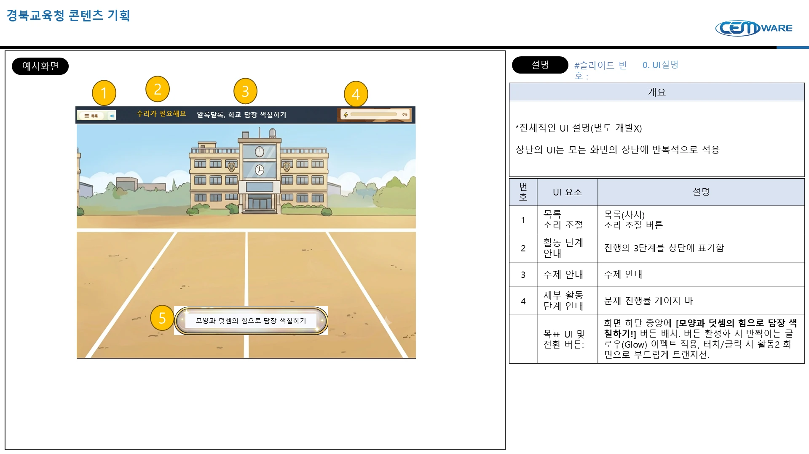

### 개요

*전체적인 UI 설명(별도 개발X)

상단의 UI는 모든 화면의 상단에 반복적으로 적용

| 번호 | UI 요소 | 설명 |
|---:|---|---|
| 1 | 목록 소리 조절 | 목록(차시) 소리 조절 버튼 |
| 2 | 활동 단계 안내 | 진행의 3단계를 상단에 표기함 |
| 3 | 주제 안내 | 주제 안내 |
| 4 | 세부 활동 단계 안내 | 문제 진행률 게이지 바 |
|  | 목표 UI 및 전환 버튼: | 화면 하단 중앙에 **[모양과 덧셈의 힘으로 담장 색칠하기!]** 버튼 배치. 버튼 활성화 시 반짝이는 글로우(Glow) 이펙트 적용, 터치/클릭 시 활동2 화면으로 부드럽게 트랜지션. |

### 예시화면 문구

- 수리가 필요해요
- 와글와글, 운동회를 도와요!
- 알록달록, 학교 담장 색칠하기
- 모양과 덧셈의 힘으로 담장 색칠하기

## 1. 도입

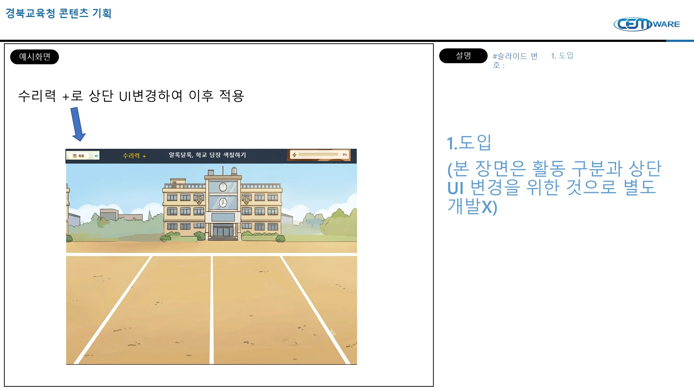

수리력 +로 상단 UI변경하여 이후 적용

1.도입

(본 장면은 활동 구분과 상단UI 변경을 위한 것으로 별도 개발X)

### 문제 상황 도입

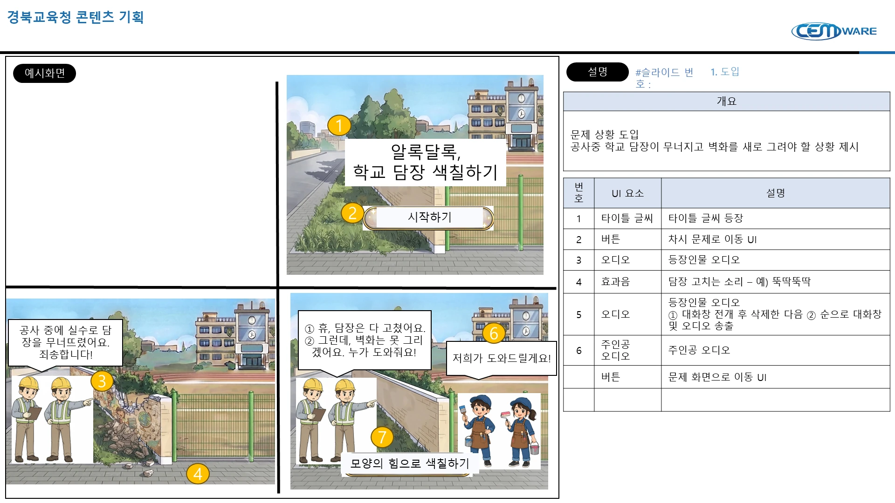

### 개요

문제 상황 도입

공사중 학교 담장이 무너지고 벽화를 새로 그려야 할 상황 제시

| 번호 | UI 요소 | 설명 |
|---:|---|---|
| 1 | 타이틀 글씨 | 타이틀 글씨 등장 |
| 2 | 버튼 | 차시 문제로 이동 UI |
| 3 | 오디오 | 등장인물 오디오 |
| 4 | 효과음 | 담장 고치는 소리 – 예) 뚝딱뚝딱 |
| 5 | 오디오 | 등장인물 오디오 ① 대화창 전개 후 삭제한 다음 ② 순으로 대화창 및 오디오 송출 |
| 6 | 주인공 오디오 | 주인공 오디오 |
|  | 버튼 | 문제 화면으로 이동 UI |

### 예시화면 문구

- 알록달록, 학교 담장 색칠하기
- 시작하기
- 공사 중에 실수로 담장을 무너뜨렸어요. 죄송합니다!
- ① 휴, 담장은 다 고쳤어요. ② 그런데, 벽화는 못 그리겠어요. 누가 도와줘요!
- 저희가 도와드릴게요!
- 모양의 힘으로 색칠하기

## 2. 수리가 필요해요 1

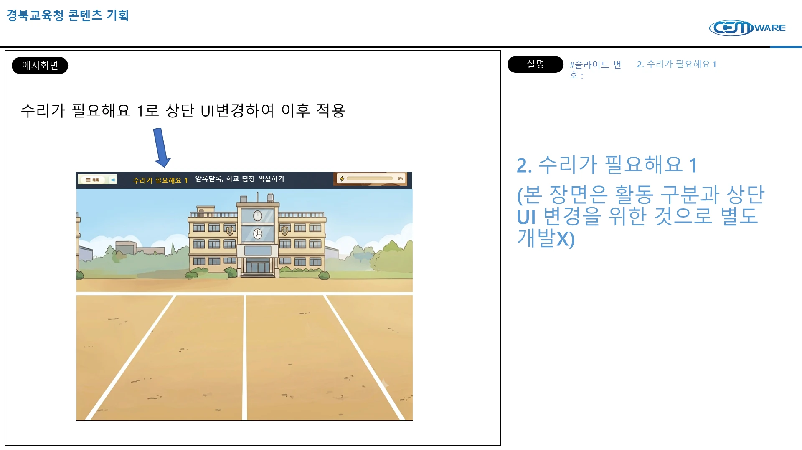

수리가 필요해요 1로 상단 UI변경하여 이후 적용

2. 수리가 필요해요 1

(본 장면은 활동 구분과 상단UI 변경을 위한 것으로 별도 개발X)

### 1. 수리가 필요해요

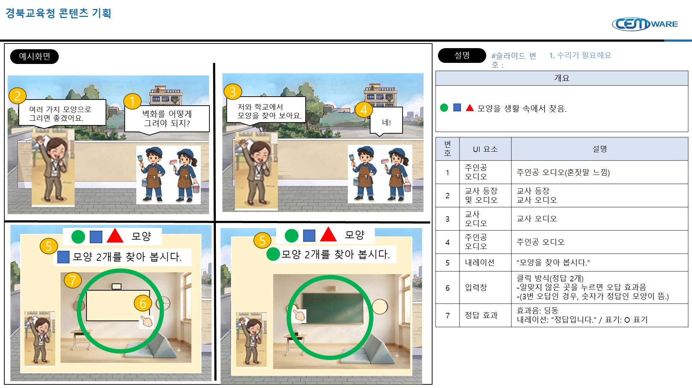

### 개요

모양을 생활 속에서 찾음.

| 번호 | UI 요소 | 설명 |
|---:|---|---|
| 1 | 주인공 오디오 | 주인공 오디오(혼잣말 느낌) |
| 2 | 교사 등장 및 오디오 | 교사 등장 교사 오디오 |
| 3 | 교사 오디오 | 교사 오디오 |
| 4 | 주인공 오디오 | 주인공 오디오 |
| 5 | 내레이션 | “모양을 찾아 봅시다.” |
| 6 | 입력창 | 클릭 방식(정답 2개) -알맞지 않은 곳을 누르면 오답 효과음 -(3번 오답인 경우, 숫자가 정답인 모양이 뜸.) |
| 7 | 정답 효과 | 효과음: 딩동 내레이션: “정답입니다.” / 표기: O 표기 |

### 예시화면 문구

- 여러 가지 모양으로 그리면 좋겠어요.
- 벽화를 어떻게 그려야 되지?
- 저와 학교에서 모양을 찾아 보아요.
- 네!
- 모양 2개를 찾아 봅시다.

### 1. 수리가 필요해요

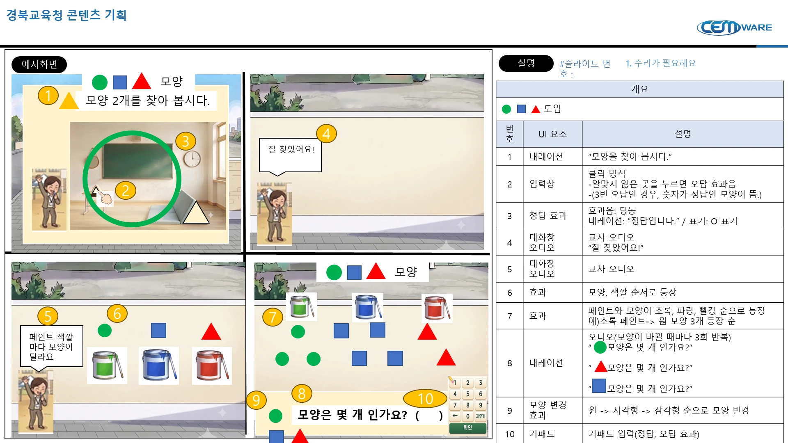

### 개요

도입

| 번호 | UI 요소 | 설명 |
|---:|---|---|
| 1 | 내레이션 | “모양을 찾아 봅시다.” |
| 2 | 입력창 | 클릭 방식 -알맞지 않은 곳을 누르면 오답 효과음 -(3번 오답인 경우, 숫자가 정답인 모양이 뜸.) |
| 3 | 정답 효과 | 효과음: 딩동 내레이션: “정답입니다.” / 표기: O 표기 |
| 4 | 대화창 오디오 | 교사 오디오 “잘 찾았어요!” |
| 5 | 대화창 오디오 | 교사 오디오 |
| 6 | 효과 | 모양, 색깔 순서로 등장 |
| 7 | 효과 | 페인트와 모양이 초록, 파랑, 빨강 순으로 등장 예)초록 페인트-> 원 모양 3개 등장 순 |
| 8 | 내레이션 | 오디오(모양이 바뀔 때마다 3회 반복) “●모양은 몇 개 인가요?”  “▲모양은 몇 개 인가요?”  “■모양은 몇 개 인가요?” |
| 9 | 모양 변경 효과 | 원 -> 사각형 -> 삼각형 순으로 모양 변경 |
| 10 | 키패드 | 키패드 입력(정답, 오답 효과) |

### 예시화면 문구

- ▲모양 2개를 찾아 봅시다.
- 잘 찾았어요!
- 페인트 색깔마다 모양이 달라요
- ● ■ ▲ 모양
- 모양은 몇 개 인가요?  (     )

### 1. 수리가 필요해요

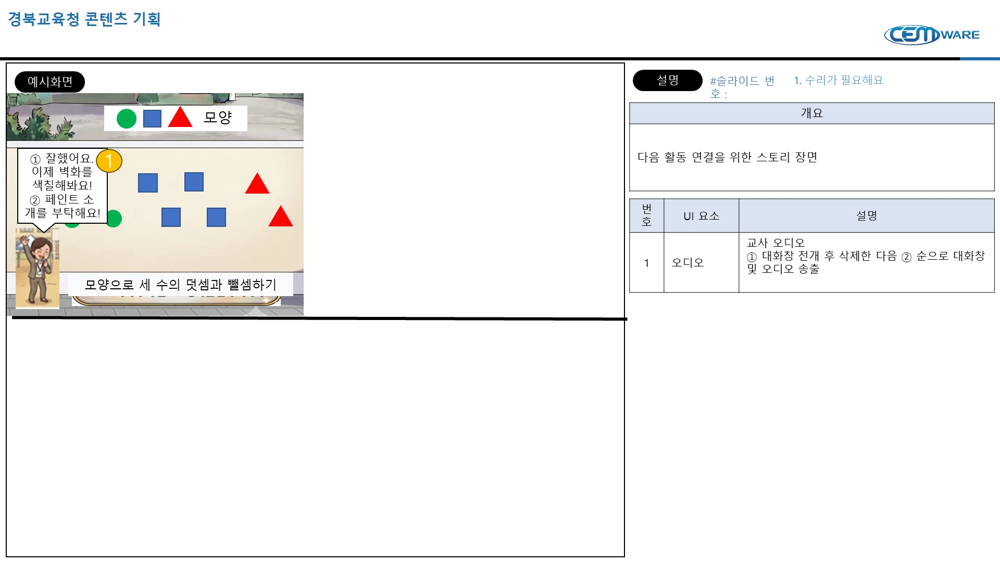

### 개요

다음 활동 연결을 위한 스토리 장면

| 번호 | UI 요소 | 설명 |
|---:|---|---|
| 1 | 오디오 | 교사 오디오 ① 대화창 전개 후 삭제한 다음 ② 순으로 대화창 및 오디오 송출 |

### 예시화면 문구

- ① 잘했어요. 이제 벽화를 색칠해봐요! ② 페인트 소개를 부탁해요!
- 모양으로 세 수의 덧셈과 뺄셈하기

## 3. 수리가 필요해요 2

수리가 필요해요 2로 상단 UI변경하여 이후 적용

3. 수리가 필요해요 2

(본 장면은 활동 구분과 상단UI 변경을 위한 것으로 별도 개발X)

### 1. 수리가 필요해요

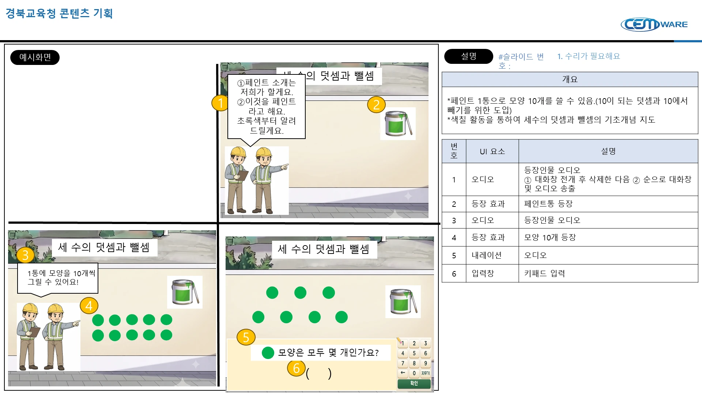

### 개요

*페인트 1통으로 모양 10개를 쓸 수 있음.(10이 되는 덧셈과 10에서 빼기를 위한 도입)

*색칠 활동을 통하여 세수의 덧셈과 뺄셈의 기초개념 지도

| 번호 | UI 요소 | 설명 |
|---:|---|---|
| 1 | 오디오 | 등장인물 오디오 ① 대화창 전개 후 삭제한 다음 ② 순으로 대화창 및 오디오 송출 |
| 2 | 등장 효과 | 페인트통 등장 |
| 3 | 오디오 | 등장인물 오디오 |
| 4 | 등장 효과 | 모양 10개 등장 |
| 5 | 내레이션 | 오디오 |
| 6 | 입력창 | 키패드 입력 |

### 예시화면 문구

- 세 수의 덧셈과 뺄셈
- ①페인트 소개는 저희가 할게요. ②이것을 페인트라고 해요. 초록색부터 알려드릴게요.
- 1통에 모양을 10개씩 그릴 수 있어요!
- 모양은 모두 몇 개인가요?
- (    )

### 1. 수리가 필요해요

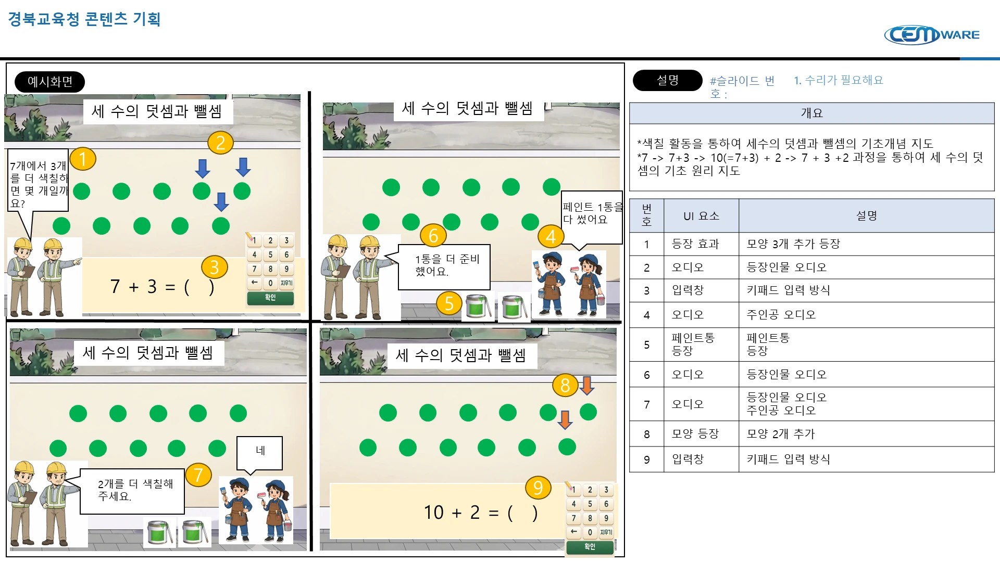

### 개요

*색칠 활동을 통하여 세수의 덧셈과 뺄셈의 기초개념 지도

*7 -> 7+3 -> 10(=7+3) + 2 -> 7 + 3 +2 과정을 통하여 세 수의 덧셈의 기초 원리 지도

| 번호 | UI 요소 | 설명 |
|---:|---|---|
| 1 | 등장 효과 | 모양 3개 추가 등장 |
| 2 | 오디오 | 등장인물 오디오 |
| 3 | 입력창 | 키패드 입력 방식 |
| 4 | 오디오 | 주인공 오디오 |
| 5 | 페인트통 등장 | 페인트통 등장 |
| 6 | 오디오 | 등장인물 오디오 |
| 7 | 오디오 | 등장인물 오디오 주인공 오디오 |
| 8 | 모양 등장 | 모양 2개 추가 |
| 9 | 입력창 | 키패드 입력 방식 |

### 예시화면 문구

- 세 수의 덧셈과 뺄셈
- 7개에서 3개를 더 색칠하면 몇 개일까요?
- 7 + 3 = (   )
- 페인트 1통을 다 썼어요
- 1통을 더 준비했어요.
- 2개를 더 색칠해주세요.
- 네
- 10 + 2 = (   )

### 1. 수리가 필요해요

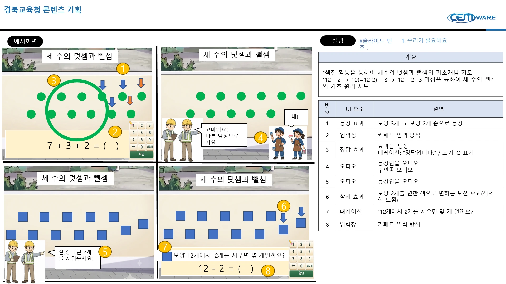

### 개요

*색칠 활동을 통하여 세수의 덧셈과 뺄셈의 기초개념 지도

*12 - 2 -> 10(=12-2) – 3 -> 12 – 2 -3 과정을 통하여 세 수의 뺄셈의 기초 원리 지도

| 번호 | UI 요소 | 설명 |
|---:|---|---|
| 1 | 등장 효과 | 모양 3개 -> 모양 2개 순으로 등장 |
| 2 | 입력창 | 키패드 입력 방식 |
| 3 | 정답 효과 | 효과음: 딩동 내레이션: “정답입니다.” / 표기: O 표기 |
| 4 | 오디오 | 등장인물 오디오 주인공 오디오 |
| 5 | 오디오 | 등장인물 오디오 |
| 6 | 삭제 효과 | 모양 2개를 연한 색으로 변하는 모션 효과(삭제한 느낌) |
| 7 | 내레이션 | “12개에서 2개를 지우면 몇 개 일까요? |
| 8 | 입력창 | 키패드 입력 방식 |

### 예시화면 문구

- 세 수의 덧셈과 뺄셈
- 7 + 3 + 2 = (   )
- 고마워요! 다른 담장으로 가요.
- 네!
- 잘못 그린 2개를 지워주세요!
- 모양 12개에서 2개를 지우면 몇 개일까요?
- 12 - 2 = (   )

### 1. 수리가 필요해요

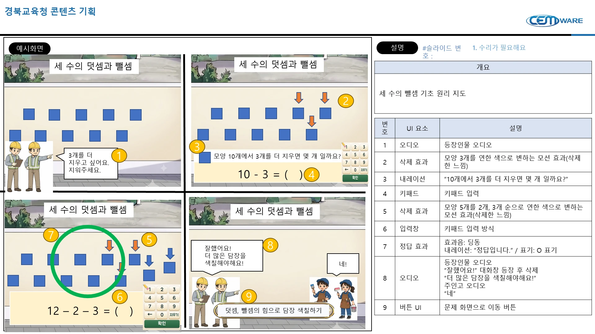

### 개요

세 수의 뺄셈 기초 원리 지도

| 번호 | UI 요소 | 설명 |
|---:|---|---|
| 1 | 오디오 | 등장인물 오디오 |
| 2 | 삭제 효과 | 모양 3개를 연한 색으로 변하는 모션 효과(삭제한 느낌) |
| 3 | 내레이션 | “10개에서 3개를 더 지우면 몇 개 일까요?” |
| 4 | 키패드 | 키패드 입력 |
| 5 | 삭제 효과 | 모양 5개를 2개, 3개 순으로 연한 색으로 변하는 모션 효과(삭제한 느낌) |
| 6 | 입력창 | 키패드 입력 방식 |
| 7 | 정답 효과 | 효과음: 딩동 내레이션: “정답입니다.” / 표기: O 표기 |
| 8 | 오디오 | 등장인물 오디오 “잘했어요!” 대화창 등장 후 삭제 “더 많은 담장을 색칠해야해요!” 주인고 오디오 “네” |
| 9 | 버튼 UI | 문제 화면으로 이동 버튼 |

### 예시화면 문구

- 세 수의 덧셈과 뺄셈
- 3개를 더 지우고 싶어요. 지워주세요.
- 모양 10개에서 3개를 더 지우면 몇 개 일까요?
- 10 - 3 = (   )
- 12 – 2 – 3 = (   )
- 잘했어요! 더 많은 담장을 색칠해야해요!
- 네!
- 덧셈, 뺄셈의 힘으로 담장 색칠하기

## 4. 수리로 해결해요

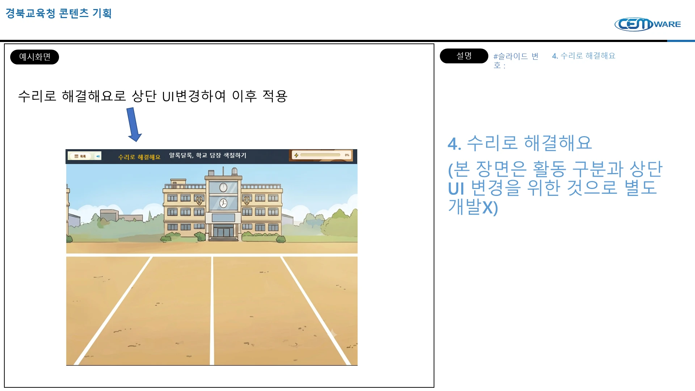

수리로 해결해요로 상단 UI변경하여 이후 적용

4. 수리로 해결해요

(본 장면은 활동 구분과 상단UI 변경을 위한 것으로 별도 개발X)

### 1. 수리가 필요해요

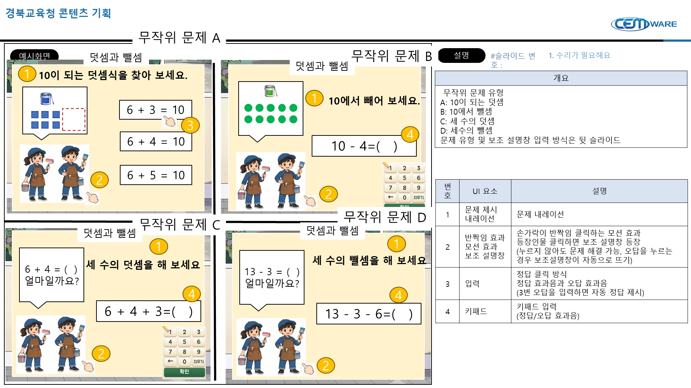

### 개요

무작위 문제 유형

A: 10이 되는 덧셈

B: 10에서 뺄셈

C: 세 수의 덧셈

D: 세수의 뺄셈

문제 유형 및 보조 설명창 입력 방식은 뒷 슬라이드

| 번호 | UI 요소 | 설명 |
|---:|---|---|
| 1 | 문제 제시 내레이션 | 문제 내레이션 |
| 2 | 반짝임 효과 모션 효과 보조 설명창 | 손가락이 반짝임 클릭하는 모션 효과 등장인물 클릭하면 보조 설명창 등장 (누르지 않아도 문제 해결 가능, 오답을 누르는 경우 보조설명창이 자동으로 뜨기) |
| 3 | 입력 | 정답 클릭 방식 정답 효과음과 오답 효과음 (3번 오답을 입력하면 자동 정답 제시) |
| 4 | 키패드 | 키패드 입력 (정답/오답 효과음) |

### 예시화면 문구

- 무작위 문제 A
  - 덧셈과 뺄셈
  - 10이 되는 덧셈식을 찾아 보세요.
  - 6 + 3 = 10
  - 6 + 4 = 10
  - 6 + 5 = 10
- 무작위 문제 B
  - 덧셈과 뺄셈
  - 10에서 빼어 보세요.
  - 10 - 4=(   )
- 무작위 문제 C
  - 덧셈과 뺄셈
  - 6 + 4 = (  ) 얼마일까요?
  - 세 수의 덧셈을 해 보세요
  - 6 + 4 + 3=(   )
- 무작위 문제 D
  - 덧셈과 뺄셈
  - 13 - 3 = (  ) 얼마일까요?
  - 세 수의 뺄셈을 해 보세요
  - 13 - 3 - 6=(   )

### 활동 2

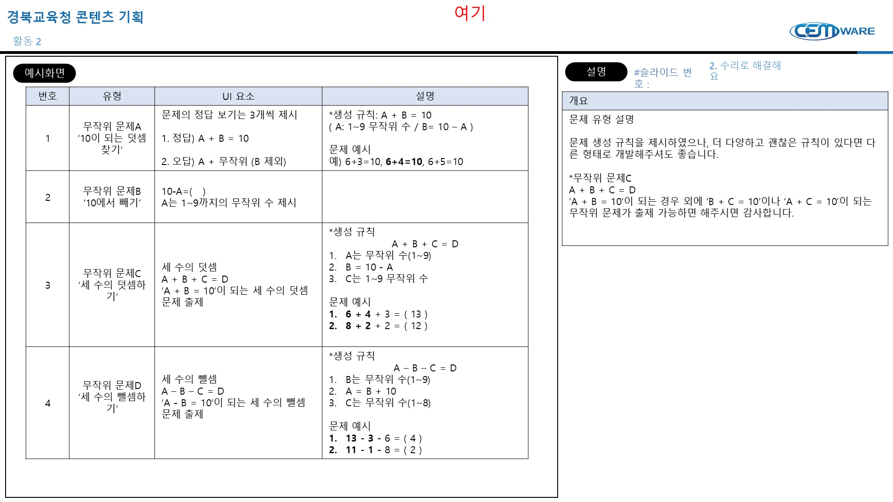

#### 2. 수리로 해결해요

#### 개요

문제 유형 설명

문제 생성 규칙을 제시하였으나, 더 다양하고 괜찮은 규칙이 있다면 다른 형태로 개발해주셔도 좋습니다.

*무작위 문제C

A + B + C = D

‘A + B = 10’이 되는 경우 외에 ‘B + C = 10’이나 ‘A + C = 10’이 되는 무작위 문제가 출제 가능하면 해주시면 감사합니다.

| 번호 | 유형 | UI 요소 | 설명 |
|---:|---|---|---|
| 1 | 무작위 문제A ‘10이 되는 덧셈 찾기’ | 문제의 정답 보기는 3개씩 제시  1. 정답) A + B = 10  2. 오답) A + 무작위 (B 제외) | *생성 규칙: A + B = 10 ( A: 1~9 무작위 수 / B= 10 – A )  문제 예시 예) 6+3=10, 6+4=10, 6+5=10 |
| 2 | 무작위 문제B ‘10에서 빼기’ | 10-A=(   ) A는 1~9까지의 무작위 수 제시 |  |
| 3 | 무작위 문제C ’세 수의 덧셈하기’ | 세 수의 덧셈 A + B + C = D ‘A + B = 10’이 되는 세 수의 덧셈 문제 출제 | *생성 규칙 A + B + C = D A는 무작위 수(1~9) B = 10 - A C는 1~9 무작위 수  문제 예시 6 + 4 + 3 = ( 13 ) 8 + 2 + 2 = ( 12 ) |
| 4 | 무작위 문제D ’세 수의 뺄셈하기’ | 세 수의 뺄셈 A – B – C = D ‘A - B = 10’이 되는 세 수의 뺄셈 문제 출제 | *생성 규칙 A – B – C = D B는 무작위 수(1~9) A = B + 10 C는 무작위 수(1~8)  문제 예시 13 - 3 - 6 = ( 4 ) 11 - 1 - 8 = ( 2 ) |

여기

### 1. 수리가 필요해요

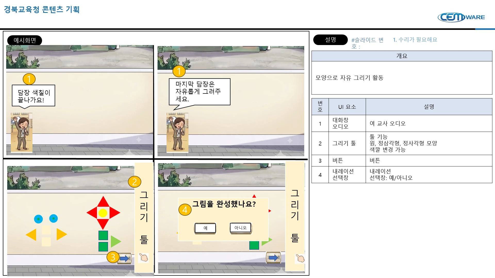

### 개요

모양으로 자유 그리기 활동

| 번호 | UI 요소 | 설명 |
|---:|---|---|
| 1 | 대화창 오디오 | 여 교사 오디오 |
| 2 | 그리기 툴 | 툴 기능 원, 정삼각형, 정사각형 모양 색깔 변경 가능 |
| 3 | 버튼 | 버튼 |
| 4 | 내레이션 선택창 | 내레이션 선택창: 예/아니오 |

### 예시화면 문구

- 담장 색칠이 끝나가요!
- 마지막 담장은 자유롭게 그려주세요.
- 그리기 툴
- 그림을 완성했나요?
- 예
- 아니오

## 4. 수리 이야기

수리 이야기 로 상단 UI변경하여 이후 적용

4. 수리 이야기

(본 장면은 활동 구분과 상단UI 변경을 위한 것으로 별도 개발X)

### 1. 수리가 필요해요

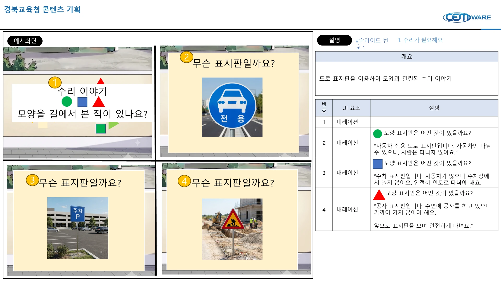

### 개요

도로 표지판을 이용하여 모양과 관련된 수리 이야기

| 번호 | UI 요소 | 설명 |
|---:|---|---|
| 1 | 내레이션 |  |
| 2 | 내레이션 | ● 모양 표지판은 어떤 것이 있을까요?  “자동차 전용 도로 표지판입니다. 자동차만 다닐 수 있으니, 사람은 다니지 않아요.” |
| 3 | 내레이션 | ■ 모양 표지판은 어떤 것이 있을까요?  “주차 표지판입니다. 자동차가 많으니 주차장에서 놀지 않아요. 안전히 인도로 다녀야 해요.” |
| 4 | 내레이션 | ▲ 모양 표지판은 어떤 것이 있을까요?  “공사 표지판입니다. 주변에 공사를 하고 있으니 가까이 가지 않아야 해요.  앞으로 표지판을 보며 안전하게 다녀요.” |

### 예시화면 문구

- 수리 이야기  모양을 길에서 본 적이 있나요?
- ● ■ ▲
- 무슨 표지판일까요?

### 3. 수리 이야기

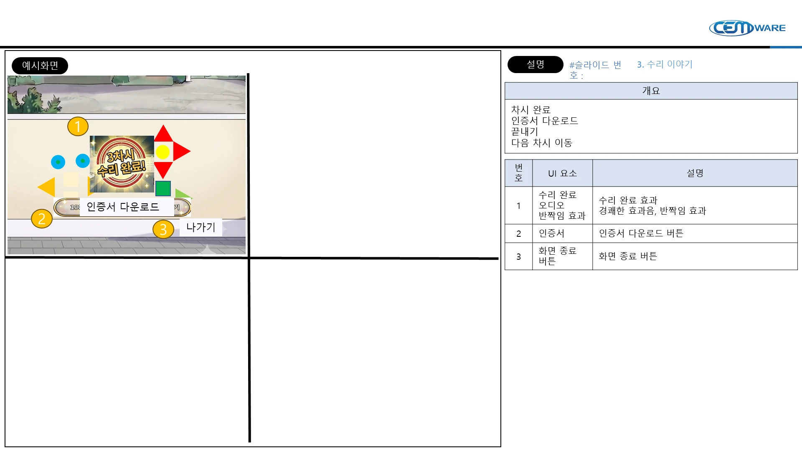

### 개요

차시 완료

인증서 다운로드

끝내기

다음 차시 이동

| 번호 | UI 요소 | 설명 |
|---:|---|---|
| 1 | 수리 완료 오디오 반짝임 효과 | 수리 완료 효과 경쾌한 효과음, 반짝임 효과 |
| 2 | 인증서 | 인증서 다운로드 버튼 |
| 3 | 화면 종료 버튼 | 화면 종료 버튼 |

### 예시화면 문구

- 3차시 수리 완료!
- 인증서 다운로드
- 나가기
