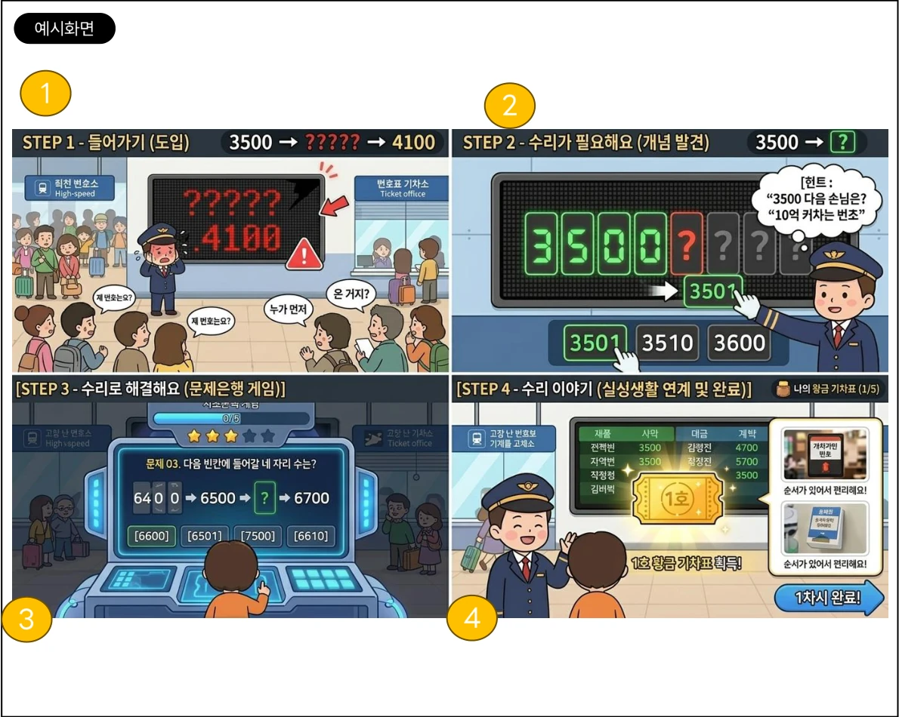
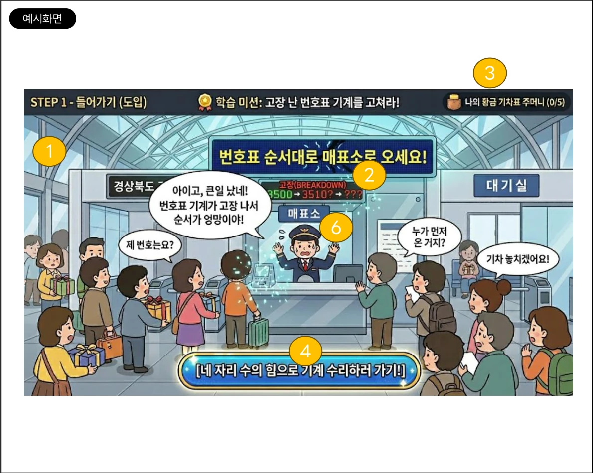
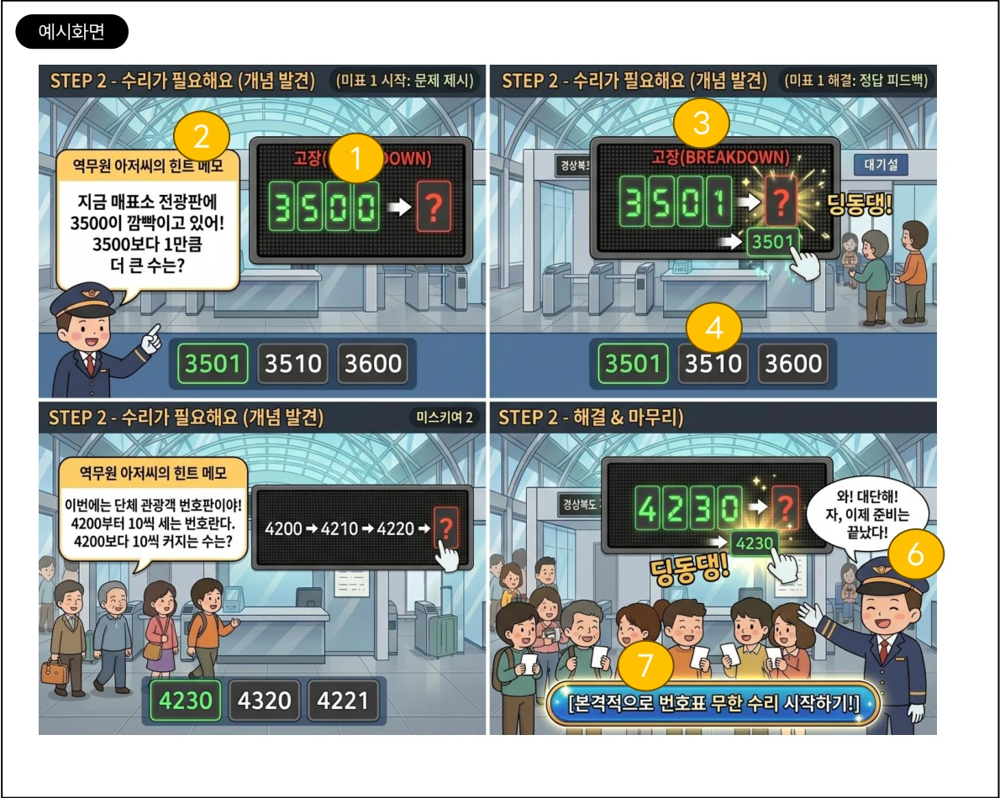
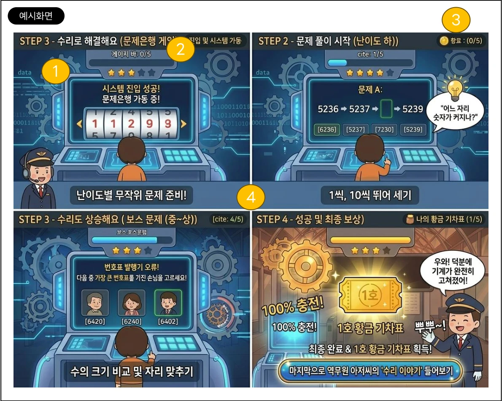
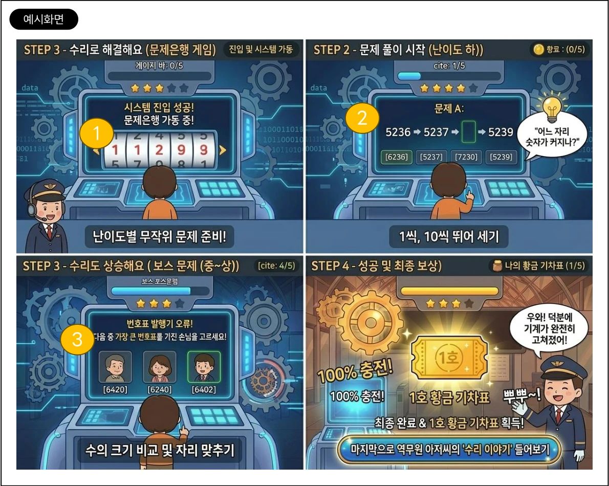
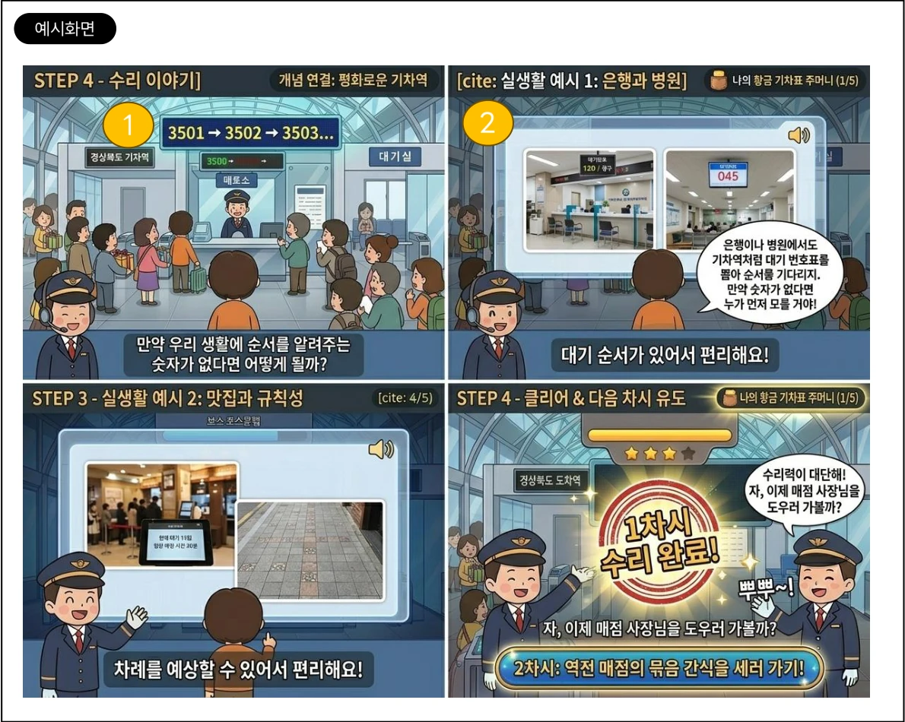
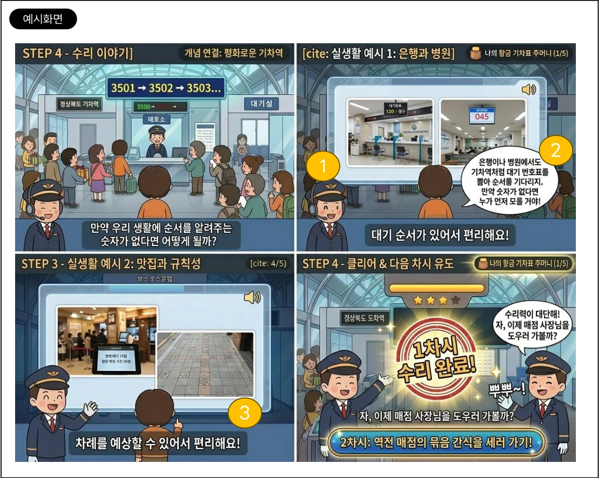
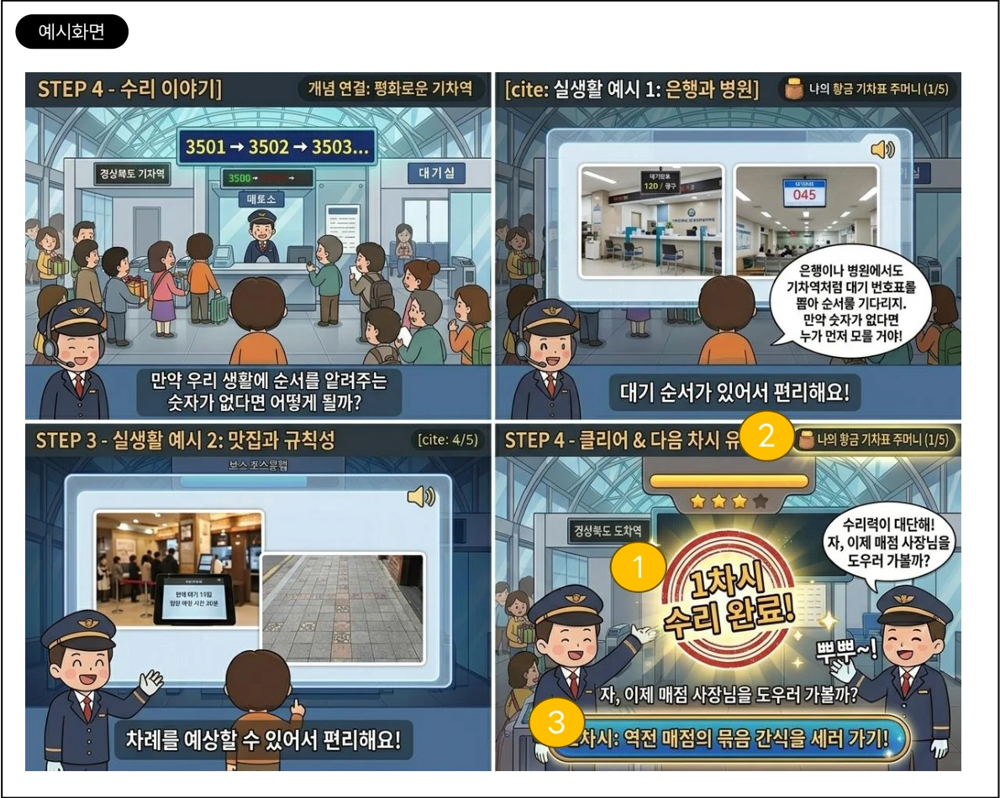

# 콘텐츠 기획_SB_임상현

원본 PDF: [콘텐츠 기획_SB_임상현.pdf](./콘텐츠%20기획_SB_%EC%9E%84%EC%83%81%ED%98%84.pdf)

본 문서는 원본 PDF의 렌더링 이미지 1~10페이지를 기준으로 재구성한 콘텐츠 기획서이다. PDF 내부 한글 텍스트 매핑이 깨져 있어, 텍스트 추출 결과가 아닌 페이지 이미지 판독을 기준으로 작성했다.

## 문서 이력

| Version | Date | Content | Page | Owner |
|---|---:|---|---:|---|
| v1.0 | 26/6/3 | 신규 제작 | 10 | 임상현 |

## 개요

| 구분 | 내용 |
|---|---|
| 공간적 배경 | 마을 기차역: 매표소 -> 매점 -> 대기실 -> 분실물 센터 -> 승강장 |
| 핵심 콘셉트 | 기차역 곳곳의 고장 난 기계와 안내판을 수학 힘, 즉 수리력으로 해결하고 "황금 기차표"를 모으는 모험 |

## 학습 정보

| 항목 | 내용 |
|---|---|
| 차시 번호 | 1-01 |
| 영역 | 수와 연산 |
| 성취 기준 | [2수01-03] 네 자리 이하의 수의 범위에서 수의 계열을 이해하고, 수의 크기를 비교할 수 있다. |
| 내용 요소 | 네 자리 이하의 수, 두 자리 수 범위의 덧셈과 뺄셈 |
| 차시 주제 | 순서가 뒤죽박죽! 기차역 매표소의 번호표 기계를 수리하라! |

## 성취수준

| 수준 | 성취수준별 내용 |
|---|---|
| A | 네 자리 이하의 수의 범위에서 수의 계열을 이해하고 여러 가지 방법으로 수를 세며, 수의 크기를 비교하고 그 방법을 설명할 수 있다. |
| B | 네 자리 이하의 수의 범위에서 수의 계열을 이해하여 뛰어 세기를 하고, 수의 크기를 비교할 수 있다. |
| C | 네 자리 이하의 수의 범위에서 수를 순서대로 말하고, 구체적인 조작 활동을 통하여 수의 크기를 비교할 수 있다. |

## 전체 흐름

기차역을 배경으로 4자리 수 세기 콘텐츠를 4단계로 구성한다. 전체 흐름 설명을 위한 페이지이며, 개발 대상 화면은 아니다.

| 단계 | 화면 | 의도 |
|---:|---|---|
| 1 | STEP 1 - 들어가기 | 명절 전날 혼란스러운 기차역에서 고장 난 번호표 전광판과 당황한 역무원을 통해 문제 상황을 제시한다. |
| 2 | STEP 2 - 수리가 필요해요 | 역무원의 힌트 메모 팝업창과 고장 난 모니터를 보여준다. 하단 숫자 카드 3장을 드래그 앤 드롭 방식으로 풀이하며 개념을 발견한다. |
| 3 | STEP 3 - 수리로 해결해요 | 무작위 문제 출제 시스템이 작동하는 게임 화면이다. 상단 게이지 바, 중앙 문제 영역, 보기 번호들, 하단 입력 UI로 구성한다. |
| 4 | STEP 4 - 수리 이야기 | 정상 작동하는 번호표 기계와 질서 있게 표를 사는 승객을 보여준다. 역무원이 주인공에게 황금 기차표 1호를 주고, 1차시 완료 버튼을 제공한다. |

## 활동 1. 들어가기

### 개요

명절 전날 기차역의 혼란스러운 상황을 시각, 청각적으로 제시하여 학습자가 스스로 문제를 해결해야겠다는 책임감과 동기를 갖도록 한다.

### 화면 및 UI 요소

| 번호 | UI 요소 | 설명 |
|---:|---|---|
| 1 | 배경 화면 | 명절 분위기로 북적북적하고 활기찬 기차역 대합실과 매표소 창구 화면을 구성한다. |
| 2 | 메인 오류 UI: 전광판 | 매표소 창구 위 전광판 숫자가 `3500`, `????`, `4100` 등 뒤죽박죽 깨져 깜빡이는 효과를 연출한다. |
| 3 | 상시 노출 UI | 우측 상단에 학습 보상 목표인 `나의 황금 기차표 주머니 (0/5)`를 고정 노출한다. |
| 4 | 목표 UI 및 전환 버튼 | 화면 하단 중앙에 `[네 자리 수의 힘으로 기계 수리하러 가기!]` 버튼을 배치한다. 버튼 활성화 시 반짝이는 Glow 효과를 적용하고, 클릭 시 STEP 2 화면으로 부드럽게 전환한다. |
| 5 | 내레이션 | "칙칙폭폭! 즐거운 명절 전날이에요. 어라? 무슨 일이 생긴 걸까요?"를 출력한다. BGM은 사람들이 웅성거리는 역 내부 배경 소음이다. |
| 6 | 역무원 애니메이션 | 역무원이 땀을 흘리며 당황하는 대기 모션을 취한다. 대사 출력 시 말풍선을 노출하고 보이스를 재생한다. 대사는 "아이고, 큰일 났네! 번호표 기계가 고장 나서 순서가 엉망이야!"이다. |
| 7 | 군중 | 승객 캐릭터들이 "제 번호는요?", "누가 먼저 온 거지?", "기차 놓치겠어요!" 등의 말풍선을 겹치지 않게 랜덤하게 출력한다. |

## 활동 2. 수리가 필요해요

### 개요

본격적인 문제은행 게임에 들어가기 전 튜토리얼 역할을 하는 단계이다. 네 자리 수가 1씩 커질 때와 10씩 뛰어 셀 때 어느 자릿값이 변하는지 시각적으로 명확하게 보여주어 개념을 쉽게 발견하도록 유도한다.

### 화면 및 UI 요소

| 번호 | UI 요소 | 설명 |
|---:|---|---|
| 1 | 화면 전환 연출 | EP 1의 하단 버튼을 누르면 매표소의 고장 난 대기 번호 발행기 모니터가 화면 중앙으로 크게 확대되며 미션을 시작한다. |
| 2 | 힌트 팝업창 | 역무원 아저씨 캐릭터 음성과 함께 텍스트 말풍선을 제공한다. 미션 1 텍스트는 "3500이 깜빡이고 있어! 3500보다 1만큼 더 큰 수는 무엇일까?"이다. 미션 2 텍스트는 "단체 관광객 번호판이야! 4200부터 10씩 뛰어 세는 번호란다. 4200보다 10씩 커지는 수는?"이다. |
| 3 | 중앙 문제 영역 | 고장 난 전광판 UI를 보여준다. 빈칸 영역은 `[?]` 박스가 깜빡이며 입력을 유도한다. 미션 1 노출 화면은 `3500 -> [?]`, 미션 2 노출 화면은 `4200 -> 4210 -> 4220 -> [?]`이다. |
| 4 | 하단 조작 영역 | 사용자가 직접 선택할 수 있는 숫자 카드 3장을 가로로 배치한다. 드래그 앤 드롭과 터치 방식을 모두 지원한다. |
| 5 | 오답 피드백 | 오답 카드를 `[?]` 빈칸에 끌어다 놓으면 경고음과 함께 카드가 원래 위치로 튕겨 돌아가는 Bounce back 애니메이션을 적용한다. |
| 6 | 정답 피드백 | 정답 카드를 넣으면 카드가 자석처럼 Snap되어 안착한다. 딩동댕 사운드와 함께 전광판의 찌그러진 이펙트가 사라지고 깨끗해진다. 동시에 기다리던 손님 캐릭터가 표를 받아 가는 애니메이션을 연출한다. |
| 7 | 단계 완료 트랜지션 | 2개의 미션을 모두 클리어하면 역무원의 격려 대사 "자, 이제 준비는 끝났다!"를 출력하고, 화면 하단에 다음 단계 버튼을 활성화한다. |

## 활동 3. 수리로 해결해요

### 개요

본격적인 문제 풀이 단계이다. 뛰어 세기 규칙과 자릿값이 무작위로 바뀌는 문항을 해결하면서 네 자리 수의 계열과 크기 비교를 마스터하도록 한다.

### 화면 및 UI 요소

| 번호 | UI 요소 | 설명 |
|---:|---|---|
| 1 | 배경 화면 | 대합실 배경에서 번호표 발행기 내부 시스템으로 진입한 연출을 사용한다. 톱니바퀴가 돌아가거나 사이버 공간 같은 역동적인 배경 애니메이션을 적용한다. |
| 2 | 상단 상태 UI | 화면 상단 중앙에 문제 진행도를 나타내는 `게이지 바(0/5)`를 배치한다. 우측 상단에는 `나의 황금 기차표 주머니 (0/5)` UI를 상시 노출한다. |
| 3 | 중앙 문제판 UI | 무작위 문제은행 시스템이 작동하며, 슬롯머신 톱니바퀴처럼 숫자가 스크롤되다가 멈추면서 문제가 출제되는 역동적인 애니메이션을 적용한다. |
| 4 | 하단 입력 UI | 정답을 직접 타이핑하여 입력할 수 있는 빈칸 텍스트 필드 또는 화면 터치용 숫자 키패드 UI를 제공한다. |

### 문제은행 출제 알고리즘

총 5문제를 연속 출제한다.

| 번호 | UI 요소 | 설명 |
|---:|---|---|
| 1 | 1~2번 문항: 난이도 하 | 일의 자리 또는 십의 자리가 변하는 문제를 무작위로 출제한다. 예: `5236 -> 5237 -> [] -> 5239`. |
| 2 | 3~4번 문항: 난이도 중 | 백의 자리 또는 천의 자리가 변하는 문제를 무작위로 출제한다. 예: `2800 -> 3800 -> 4800 -> []`. |
| 3 | 5번 문항: 난이도 상 | 보스 문제로 크기 비교 문제를 출제한다. "오류! 다음 중 가장 큰 번호표를 가진 손님을 고르세요!"라는 텍스트와 함께 3개의 보기를 노출한다. 백의 자리와 십의 자리를 비교하여 가장 큰 수를 터치하도록 유도한다. 예: `[6420] vs [6240] vs [6402]`. |

## 활동 4. 수리 이야기

### 화면 연출 의도 및 목표

기차역 번호표처럼 일상생활에서 순서를 숫자로 나타내어 편리한 경우를 알아보고, 1차시에서 배운 네 자리 수와 뛰어 세기의 실생활 활용 가치를 깨닫게 한다.

### 화면 및 UI 요소

| 번호 | UI 요소 | 설명 |
|---:|---|---|
| 1 | 배경 화면 변화 | 전광판의 번호표 시스템이 정상 작동한다. `3501 -> 3502 -> 3503...` 흐름이 표시되고, 승객들이 질서 있게 표를 사는 평화로운 매표소 배경으로 변경한다. 주인공과 역무원 캐릭터를 화면 중앙에 나란히 배치한다. |
| 2 | 실생활 사진 슬라이드 UI | 역무원의 대사 타이밍에 맞춰 화면 중앙에 반투명 팝업창을 띄운다. `은행 대기 번호표`, `유명 맛집 태블릿 대기 화면`, `병원 대기 전광판` 등의 실생활 사진을 부드럽게 페이드 인/아웃한다. |

### 내레이션 및 대사

| 번호 | 요소 | 설명 |
|---:|---|---|
| 1 | 도입 대사 | 역무원이 흐뭇하게 웃는 애니메이션과 함께 대사를 출력한다. 대사는 "휴, 친구 덕분에 기차역이 다시 평화를 찾았어! 고마워. 만약 우리 생활에 순서를 알려주는 숫자가 없다면 어떻게 될까?"이다. |
| 2 | 핵심 내레이션 | "오늘 우리가 고친 기차역 번호표처럼, 일상생활에서 순서를 숫자로 나타내어 편리한 경우는 또 어디에 있을까요?"를 음성으로 출력한다. |
| 3 | 설명 대사 | 사진 슬라이드가 지나갈 때 역무원 대사를 노출한다. 대사는 "은행이나 맛집에서도 번호표를 받으면 내 순서를 알 수 있어 정말 편리하단다. 숫자가 커지는 규칙을 알면 내 차례를 정확히 예상할 수 있지!"이다. |

### 완료 및 다음 차시 유도

| 번호 | UI 요소 | 설명 |
|---:|---|---|
| 1 | 클리어 연출 | 모든 이야기가 끝나면 경쾌한 클리어 사운드와 함께 화면 정중앙에 `[1차시 수리 완료!]` 도장을 찍는 흔들림 애니메이션을 적용한다. |
| 2 | 아이템 확인 UI | 우측 상단 `1호 황금 기차표`가 반짝이며 획득 상태 `(1/5)`를 최종 고정한다. |
| 3 | 다음 차시 유도 버튼 | 역무원의 마지막 안내 대사 "자, 이제 매점 사장님을 도우러 가볼까?"와 함께 화면 하단에 `[2차시: 역전 매점의 묶음 간식을 세러 가기!]` 버튼을 활성화한다. 해당 버튼 클릭 시 2차시 콘텐츠 화면으로 전환한다. |

## 개발 관점 메모

| 구분 | 요구사항 |
|---|---|
| 입력 방식 | 드래그 앤 드롭, 터치 선택, 숫자 키패드 또는 텍스트 입력을 상황별로 지원한다. |
| 피드백 | 정답은 Snap, 효과음, 전광판 정상화, 캐릭터 반응으로 강화한다. 오답은 Bounce back과 경고음으로 처리한다. |
| 상태 관리 | 문제 진행도 `(0/5)`, 황금 기차표 주머니 `(0/5 -> 1/5)`, 차시 완료 상태를 유지한다. |
| 전환 | 활동 1에서 활동 2로 Zoom-in, 활동 2 완료 후 활동 3 진입, 활동 4 완료 후 2차시 유도 버튼으로 이동한다. |
| 접근성 | 주요 대사와 내레이션은 텍스트 말풍선과 음성 출력이 함께 제공되어야 한다. |
